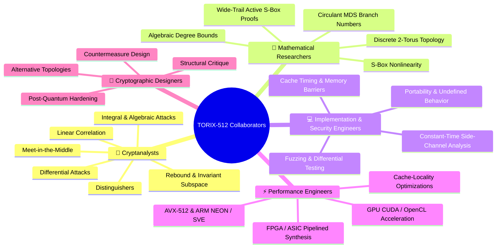
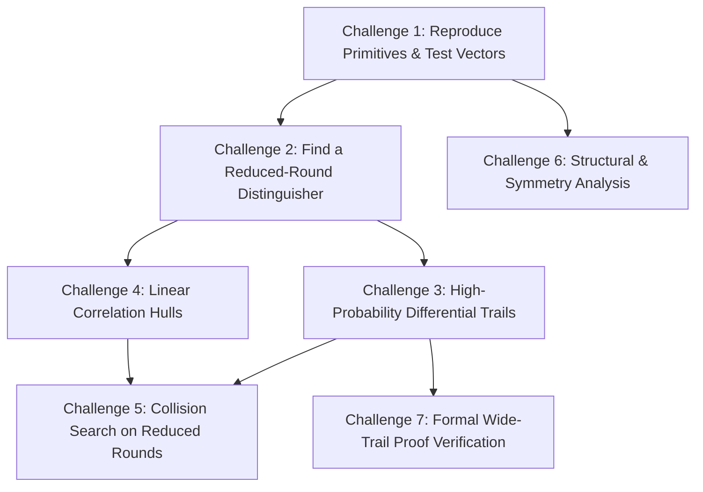

# TORIX-512 Open Cryptographic Research Project & Cryptanalysis Challenge

> [!IMPORTANT]
> **Open Cryptanalysis Invitation:**  
> **TORIX-512 is an experimental 512-bit cryptographic hash and permutation construction.**  
> The algorithm and its reference implementations are now complete enough for rigorous, independent evaluation.  
> 
> **We explicitly do NOT claim that TORIX-512 is cryptographically secure.**  
> The objective of this project is to invite the global academic and security community to **attack, analyze, dissect, and attempt to break the construction** before making any such claims. Negative results, distinguishers, and structural flaws are our most valuable deliverables.

---

## 1. The Challenge: Try to Break TORIX-512

Do not assume the construction is secure because its cellular geometry appears mathematically intricate. Real cryptographic trust is earned solely through sustained, hostile, and independent cryptanalysis.

If you discover:
* ⚠️ **A statistical anomaly or non-random bias** in output bits
* ⚠️ **A distinguisher** separating reduced-round or full-round variants from a random oracle
* ⚠️ **An unexpected structural property** (rotational symmetry, slide attack, fixed point, or invariant subspace)
* ⚠️ **A high-probability differential trail** through reduced or full rounds
* ⚠️ **A statistically significant linear approximation** or correlation hull
* ⚠️ **A practical or theoretical collision / semi-free-start collision** strategy
* ⚠️ **A preimage or second-preimage attack** faster than brute-force complexity
* ⚠️ **An implementation bug**, side-channel leak, or undefined behavior
* ⚠️ **A mathematical loophole** in our wide-trail active S-box proofs

👉 **Please document your methodology, write a proof-of-concept, and submit it!** Every confirmed weakness will be credited, published openly, and addressed in the evolutionary redesign cycle.

---

## 2. Who We Are Looking For

We are building a multidisciplinary research network of academic cryptographers, security engineers, mathematicians, and systems developers:



### 🔐 1. Cryptanalysts
* **Focus Areas:** Differential cryptanalysis, linear cryptanalysis, higher-order differential attacks, integral cryptanalysis, rebound attacks, rotational symmetries, algebraic attacks, slide attacks, and biclique preimages.
* **Target:** Break reduced-round versions ($r = 2, 4, 6, 8$) or demonstrate non-random behavior on the full 16-round primitive.

### 🧮 2. Mathematical Researchers
* **Focus Areas:** Group theory on discrete 2-torus $\mathbb{T}^2 = (\mathbb{Z}/8\mathbb{Z}) \times (\mathbb{Z}/8\mathbb{Z})$, diffusion metrics of circulant GF($2^8$) MDS matrices, differential uniformity ($\delta_{\max} = 8$), branch numbers, algebraic degree growth, and wide-trail bound verification.
* **Target:** Mathematically confirm or refute the claim that 16 rounds guarantee $n_{\text{act}} \ge 544$ active S-boxes.

### 💻 3. Implementation & Security Engineers
* **Focus Areas:** Fuzzing (AFL++, LibFuzzer), constant-time execution verification (dudect, valgrind), endian invariance across Big-Endian architectures, compiler sanitizers (ASan, UBSan, MSan), and portable fallback robustness.
* **Target:** Identify memory safety bugs, compiler optimizations that eliminate `h512_cleanse`, or microarchitectural cache-timing side-channels.

### ⚡ 4. Performance Engineers
* **Focus Areas:** SIMD vectorization (AVX-512, ARM NEON, ARM SVE2, RISC-V Vector), parallel tree scheduling, CUDA/OpenCL parallel hashing kernels, and Verilog/VHDL FPGA synthesis.
* **Target:** Push bulk throughput beyond the current native AVX2 4-way baseline.

### 🧠 5. Cryptographic Designers
* **Focus Areas:** Constructive redesign. Rather than merely asking *"can you fix my code?"*, we ask: *"What structural weaknesses exist in this cellular network, and what alternative primitives would improve security margin and diffusion efficiency?"*

---

## 3. The 7 Active Research Missions

We have partitioned the research agenda into 7 concrete, actionable challenge tracks:



### 🎯 Challenge #1 — Independent Clean-Room Primitive Reproduction
* **Objective:** Implement the cellular coupled step, the nonlinear core ($N_{\text{bio}}$), the circulant MDS matrix layer, and HAIFA padding completely from scratch in your language of choice (Rust, Go, C++, Zig, Haskell, etc.) following only the [Formal Specification](docs/PROJECT_H512_MASTER_CRYPTOGRAPHIC_DOSSIER.md).
* **Success Criteria:** Verify that your clean-room implementation matches all certified Known Answer Tests (KATs) for `"abc"`, `""`, and variable-length CAVP vectors bit-for-bit.

### 🎯 Challenge #2 — Construct a Reduced-Round Distinguisher
* **Objective:** Determine the maximum number of rounds $r < 16$ for which the output of the permutation $P_r$ or the compression function can be distinguished from an ideal random permutation/oracle with advantage $> 2^{-64}$.
* **Current State:** 2 rounds achieve 100% Strict Avalanche Criterion (SAC) diffusion. Can an integral, zero-correlation, or cube distinguisher pierce through 4 or 6 rounds?

### 🎯 Challenge #3 — Differential Trail Search
* **Objective:** Deploy automated differential search tools (e.g., SAT/SMT solvers, MILP models, or heuristic Matsui searches) to locate optimal differential trails across $r \in \{2, 3, 4, 6\}$ rounds.
* **Key Metric:** Does any differential trail across 4 rounds have probability $P_{\text{diff}} > 2^{-64}$? Across 8 rounds have $P_{\text{diff}} > 2^{-256}$?

### 🎯 Challenge #4 — Linear Correlation & Correlation Hulls
* **Objective:** Search for statistically significant linear approximations connecting input parity masks $\alpha$ to output masks $\beta$.
* **Key Metric:** Quantify the maximum correlation $|C(\alpha, \beta)|$ across 2, 4, and 8 rounds and assess the impact of linear hull clustering caused by the toroidal cyclic boundary conditions.

### 🎯 Challenge #5 — Semi-Free-Start & Chosen-IV Collisions
* **Objective:** Exploit the Miyaguchi-Preneel feedforward equation $S_i = P_{16}(S_{i-1} \oplus M \oplus C) \oplus S_{i-1} \oplus M$ to find collisions when the attacker is granted partial control over the initial state $S_{i-1}$ or message blocks $M$.
* **Current State:** The HAIFA diagonal bit-counter injection $C(i, t)$ is designed to thwart slide and fix-in-the-middle attacks. Can this defense be bypassed?

### 🎯 Challenge #6 — Symmetries, Invariant Subspaces & Fixed Points
* **Objective:** Analyze the discrete 2-torus $\mathbb{T}^2$ for rotational symmetries, diagonal subspace invariances, or fixed points ($P(S) = S$).
* **Current State:** $N_{\text{bio}}$ has been proven to have zero fixed points ($N_{\text{bio}}(x) \neq x$) and zero opposite fixed points ($N_{\text{bio}}(x) \neq \bar{x}$). Do spatial symmetries emerge when combined with the row/column rotations?

### 🎯 Challenge #7 — Verification of the Wide-Trail Security Proof
* **Objective:** Review the mathematical argument in [Chapter 5](docs/H512_SPECIFICATION_CHAPTER_5_COMPRESSION.md) asserting that 16 rounds guarantee $\ge 544$ active S-boxes.
* **Question for Theorists:** Does the interaction between local 4-neighbor Von Neumann coupling and global circulant MDS matrix multiplication strictly satisfy the branch number lower bound $\mathcal{B} \ge 5$ across all possible differential cancellation trajectories?

---

## 4. The Evolutionary Design Cycle

We reject "security by proclamation." Instead, TORIX-512 follows an open, evolutionary feedback loop:

```
             ┌──────────────────────────────────────────────┐
             │       TORIX-512 Specification Freeze         │
             │           (Current Baseline: v1.0)           │
             └──────────────────────┬───────────────────────┘
                                    │
                                    ▼
             ┌──────────────────────────────────────────────┐
             │    Independent Testing & Cryptanalysis       │
             │     (External Researchers, Universities)     │
             └──────────────────────┬───────────────────────┘
                                    │
                         Is a weakness discovered?
                                    │
                    ┌───────────────┴───────────────┐
                    │                               │
                 [ NO ]                          [ YES ]
                    │                               │
                    ▼                               ▼
    ┌───────────────────────────────┐ ┌───────────────────────────────┐
    │  Document Resilience Bounds   │ │  Publicly Credit Researcher   │
    │  & Accumulate Evidence Base   │ │  Publish Discovered Weakness  │
    └───────────────────────────────┘ └──────────────┬────────────────┘
                    │                               │
                    │                               ▼
                    │                 ┌───────────────────────────────┐
                    │                 │  Engineered Redesign Phase    │
                    │                 │  (e.g., S-box / Round Update) │
                    │                 └──────────────┬────────────────┘
                    │                               │
                    │                               ▼
                    │                 ┌───────────────────────────────┐
                    │                 │  Issue New Version Milestone  │
                    │                 │    (e.g., TORIX-512 v1.1)     │
                    │                 └──────────────┬────────────────┘
                    │                               │
                    └───────────────────────────────┘
                                    │
                                    ▼
                         Target: Certified Rigor
```

If a flaw is discovered, we do not conceal it:
* The weakness will be formally documented in our security log.
* The researcher will receive primary credit in the project changelog, papers, and repository.
* A revised version (e.g., `v1.1`) will be released addressing the specific mathematical vector.

---

## 5. Reference Materials & Test Vectors

Before initiating analysis, verify your tools against the official reference materials:

| Resource | Description | Location |
|---|---|---|
| **Definitive Cryptographic Dossier** | Comprehensive mathematical formulation and security bounds | [docs/PROJECT_H512_MASTER_CRYPTOGRAPHIC_DOSSIER.md](docs/PROJECT_H512_MASTER_CRYPTOGRAPHIC_DOSSIER.md) |
| **API & Syntax Reference** | Complete C99/AVX2 and Python interface manual | [docs/TORIX_API_AND_SYNTAX_MANUAL.md](docs/TORIX_API_AND_SYNTAX_MANUAL.md) |
| **Step-by-Step Numerical Trace** | Bit-exact trace through all 16 rounds on `"abc"` | [docs/HOW_IT_WORKS.md](docs/HOW_IT_WORKS.md) |
| **Single-File Native C Engine** | Pure C99/AVX2 implementation with zero dynamic allocations | [src/h512.c](src/h512.c) & [src/h512.h](src/h512.h) |
| **Pure Python Reference** | Educational, readable reference implementation | [python/h512.py](python/h512.py) |
| **NIST FIPS 140-3 Test Suite** | Automated KAT and 100,000-iteration Monte Carlo verification | [tests/test_fips_kat.py](tests/test_fips_kat.py) |

### Certified Known Answer Test (KAT) Vectors
```
KAT #1: Empty String ("") [64 Bytes]
c43cc267c5e98b5c8c9b543814e1b3c5cee767cf1f214d89cf1d47090abf7a73ec2de95bf83a1907ba0b9fdea014db70f0092ef6b81a71d14f45fc7a14391f92

KAT #2: Standard Test Vector ("abc") [64 Bytes]
97baaec0f04a1cf09d88848a4bf32651d339892f5660096e5dd60defde26d0f1a94ab08d34ac5605843762fdb249c10ef2acf02c0a59526c94d9a718fc8be079

KAT #3: Truncated 256-bit Vector ("abc") [32 Bytes]
340fd4b0c928c1e52e4076e4ef4dad0721597a4180d80004cb84f4326d640153

KAT #4: 100,000-Iteration NIST Monte Carlo Golden Root (Seed: "TORIX-512-MONTE-CARLO-SEED")
44646601161bf9acc5a666eb6f97a5111f195c10917495731003004ee47fbc7d13154e0d5d0c2e7b202a9d2fe271a4cba4b6c094d46887dffd2040911b39bd01
```

---

## 6. Academic Outreach & Cold Contact Template

When inviting professors, PhD researchers, or cryptographic groups to review the design, transparency and humility are paramount. Use this template:

```text
Subject: Cryptographic Research Outreach: Independent Analysis of TORIX-512

Dear Professor / Dr. [Last Name],

I am currently working on an experimental 512-bit cryptographic hash and permutation construction called TORIX-512.

The construction is now complete enough for independent implementation and cryptanalysis, and I am actively seeking researchers who are willing to attempt to break it rather than merely validate it.

I am particularly interested in independent evaluation of its:
- Differential and linear trail bounds
- Cellular toroidal diffusion dynamics (Von Neumann 4-neighbor coupling over T^2)
- Involutive circulant GF(2^8) MDS diffusion structure
- Algebraic degree and resistance to algebraic / integral distinguishers
- Active S-box count verification (claimed n_act >= 544 across 16 rounds)

I am explicitly NOT claiming that TORIX-512 is cryptographically secure. The goal of opening the project to external researchers is to discover flaws, identify structural weaknesses, and use those findings to improve or fundamentally redesign the construction.

The specification, reference C99/AVX2 source, Python reference, and certified NIST test vectors are publicly available at:
https://github.com/ankushpahal-12/torix-crypto

I would genuinely welcome your criticism—especially if your conclusion is that aspects of the construction should be redesigned or abandoned.

Thank you very much for your time and expertise.

Sincerely,
Ankush Pahal
Lead Researcher, Project TORIX-512
```

---

## 7. How to Submit Findings & Contributions

We welcome contributions via GitHub Issues and Pull Requests. Please tag your submissions according to the domain:

| Tag / Label | Description |
|---|---|
| `cryptanalysis` | Attacks, differential trails, linear correlations, distinguishers, or collision attempts |
| `security-review` | Implementation security, side-channel analysis, memory safety, or fuzzing findings |
| `mathematics` | Mathematical proofs, S-box analysis, MDS properties, or branch number evaluation |
| `performance` | AVX-512, ARM NEON, CUDA GPU, FPGA, or micro-architectural optimizations |
| `cleanroom-impl` | Independent implementations in Rust, Go, Zig, C++, or other languages |
| `research-idea` | Novel structural ideas, alternative round functions, or post-quantum defenses |

All findings—including theoretical attacks with non-practical complexity—are treated as first-class scientific contributions.

*Let's build a cryptographically robust standard through adversarial transparency.*
