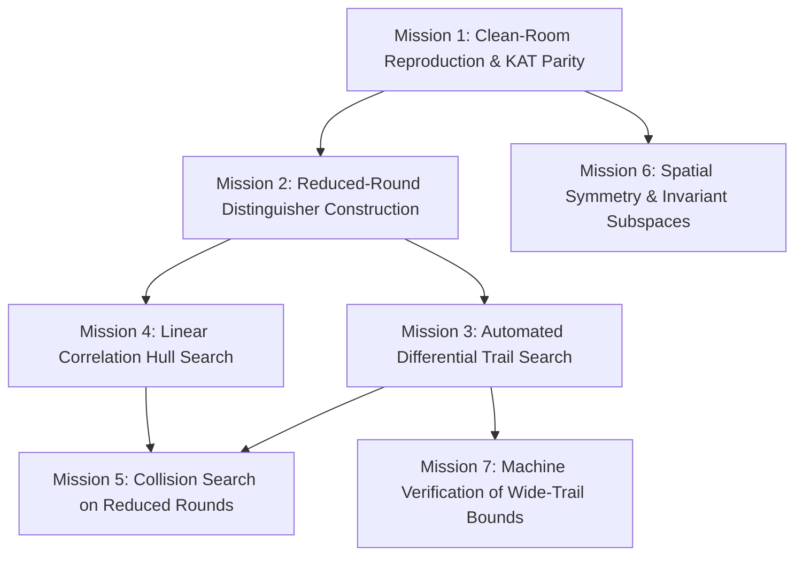

# TORIX Cryptographic Research Project: Cryptanalysis Challenge and Contribution Guide

Document Identifier: TORIX-RES-CHALLENGE-REV2.0  
Status: Active Open Research Invitation & Engineering Contribution Specification  
Compliance: NIST FIPS 140-3 POST, RFC 5869 (HKDF), HAIFA Framework, BLAKE3 Tree Topologies  
Target Audience: Cryptanalysts, Theoretical Computer Scientists, Security Engineers, and Systems Architects  

---

## Abstract

TORIX-512 is an experimental 512-bit cryptographic hash and permutation construction. The primitive operates over an 8x8 octet discrete 2-torus state geometry (T^2) utilizing an algebraically generated bijective 8-round Mini-Feistel substitution box (N_bio), cyclic 4-neighbor rotational context coupling, an involutive GF(2^8) circulant MDS hyper-diffusion matrix, and dual Miyaguchi-Preneel feedforward compression.

The reference C99/AVX2 engine, Python verification harnesses, and formal mathematical specifications are frozen and open for hostile, independent cryptanalysis.

We explicitly do not assert that TORIX-512 is unconditionally secure. Real cryptographic trust cannot be established by proclamation or mathematical intricacy alone; it requires sustained adversarial evaluation by the global scientific community. This document formalizes the active cryptanalytic challenge missions, research tracks, engineering requirements, and contribution guidelines.

---

## 1. Ethical Research Covenant

All contributors and researchers engaging with this repository agree to abide by the following ethical principles:

1. **Defensive and Academic Mandate:** TORIX is developed strictly for scientific investigation, standards development, high-throughput systems research, and defensive data integrity verification.
2. **Prohibition of Malicious Weaponization:** Research submissions, tools, or proof-of-concept scripts designed to facilitate malware development, denial-of-service weapons, illegal network intrusion, or privacy violations are strictly rejected.
3. **Coordinated Responsible Disclosure:** Discovered structural flaws, high-probability differential trails, zero-day vulnerabilities, or implementation bugs must follow the coordinated disclosure process detailed in Section 8 prior to uncoordinated public release.

---

## 2. Research and Contribution Tracks

Collaboration is structured across five dedicated engineering and cryptanalytic tracks:

### Track 1: Cryptanalysis and Distinguisher Construction
- **Objective:** Identify statistical distinguishers, differential trails, linear correlations, integral properties, or algebraic shortcuts.
- **Focus Areas:**
  - Reduced-round variants: 2, 4, 6, 8, 10, and 12 rounds.
  - Full-round 16-round primitive under known or chosen message attacks.
  - S-box differential uniformity (delta_max = 8) and component nonlinearity (NL = 100).
  - Rotational, slide, and invariant subspace properties across cycling round families.

### Track 2: Mathematical Proofs and Formal Verification
- **Objective:** Formulate machine-checkable proofs or counter-models for claimed security bounds.
- **Focus Areas:**
  - Automated verification of the active S-box lower bound (claimed n_act >= 544 across 16 rounds).
  - Branch number evaluation of circulant MDS diffusion under toroidal boundary constraints.
  - SMT/SAT modeling using Z3, CryptoMiniSat, or MILP frameworks to evaluate differential cancellation paths.
  - Formal theorem proving in Lean 4, Coq, or Isabelle/HOL.

### Track 3: High-Performance Microarchitecture and Vectorization
- **Objective:** Extend hardware vectorization and line-rate processing while preserving bit-exact determinism.
- **Focus Areas:**
  - AVX-512 register mapping (ZMM) and in-register 8x8 matrix transposition networks.
  - ARM NEON and SVE2 vector kernels.
  - RISC-V Vector Extension (RVV) implementations.
  - Hardware description language (Verilog/VHDL) implementations targeting FPGA and ASIC pipelines.

### Track 4: Side-Channel Hardening and Implementation Security
- **Objective:** Eliminate physical side-channel leakages, timing differentials, and memory safety risks.
- **Focus Areas:**
  - Constant-time verification using Welch's t-test (dudect methodology).
  - Cache-timing immunity across diverse microarchitectures.
  - Elimination of compiler-induced dead-store elimination on sensitive memory cleansing.
  - Continuous fuzzing integration via AFL++ and LibFuzzer.

### Track 5: Clean-Room Multi-Language Implementations
- **Objective:** Build zero-dependency, idiomatic reference libraries in diverse programming languages.
- **Focus Areas:**
  - Rust, Go, C++, Zig, and WebAssembly implementations.
  - Full conformance with certified Known Answer Tests (KATs).

---

## 3. The 7 Active Cryptanalysis Challenge Missions

The core research agenda is organized into seven concrete research missions:



### Mission 1: Independent Clean-Room Implementation
- **Goal:** Implement the complete TORIX-512 algorithm strictly from the formal mathematical specification without inspecting the reference C or Python source code.
- **Target Languages:** Rust, Go, C++, Zig, Ada, or Haskell.
- **Validation Criteria:** Must match all official Known Answer Tests (KATs) for empty string, short inputs, block boundaries, and 100,000-iteration Monte Carlo roots bit-for-bit.

### Mission 2: Reduced-Round Distinguisher Construction
- **Goal:** Determine the maximal round count r < 16 for which output blocks can be distinguished from an ideal random permutation with advantage epsilon > 2^(-64).
- **Current Baseline:** 2 rounds achieve complete Strict Avalanche Criterion (SAC) diffusion. Can an integral, cube, zero-correlation, or higher-order differential distinguisher pierce through 4, 6, or 8 rounds?

### Mission 3: Automated Differential Trail Search
- **Goal:** Formulate MILP or SAT/SMT models to locate optimal differential trails across 2, 4, 6, and 8 rounds.
- **Key Metric:** Does any valid differential trail across 4 rounds have probability P_diff > 2^(-64)? Does any trail across 8 rounds have P_diff > 2^(-256)?

### Mission 4: Linear Correlation Hulls
- **Goal:** Search for linear approximations connecting input parity masks to output masks across reduced rounds.
- **Key Metric:** Determine the maximum correlation magnitude |C(alpha, beta)| across 2, 4, and 8 rounds, and evaluate potential linear hull clustering induced by the toroidal cyclic boundary wrapping.

### Mission 5: Semi-Free-Start and Chosen-IV Collisions
- **Goal:** Investigate whether Miyaguchi-Preneel feedforward compression can be compromised if the adversary has partial control over the input state or initial vector.
- **Defense Mechanism:** Diagonal counter injection C(i, t) and domain tag T_domain are designed to prevent slide and fix-in-the-middle attacks. Formulate proof of resilience or demonstrate explicit counter-examples.

### Mission 6: Spatial Symmetry and Invariant Subspace Analysis
- **Goal:** Analyze the discrete 2-torus manifold for rotational symmetries, diagonal subspace invariances, or fixed points (P(S) = S).
- **Current Baseline:** N_bio is proven to exhibit zero fixed points (N_bio(x) != x) and zero opposite fixed points (N_bio(x) != ~x). Verify whether spatial symmetries emerge when combined with cyclical neighbor rotations.

### Mission 7: Formal Verification of Wide-Trail Proofs
- **Goal:** Verify or refute the mathematical theorem asserting that 16 rounds strictly guarantee n_act >= 544 active S-boxes.
- **Evaluation:** Does the interaction between local 4-neighbor Von Neumann coupling and global circulant MDS matrix multiplication satisfy the differential branch number lower bound B >= 5 across all possible cancellation trajectories?

---

## 4. Engineering Standards for Code Contributions

Contributors submitting source code must adhere to these technical constraints:

### 4.1 Bit-Exact Invariance
- Cryptographic output must remain 100% deterministic and bit-exact across all platforms.
- No changes to permutation order, rotation constants, S-box values, or round counters are permitted without architectural consensus.

### 4.2 Constant-Time Execution
- **No Secret-Dependent Branches:** Control flow must never branch on key material, plaintext data, or internal sponge state octets.
- **No Secret-Indexed Memory Accesses:** S-box lookups in the native engine must use cache-prefetched arrays, bitsliced logic, or SIMD table lookups (`vpshufb`).
- **State Sanitization:** Sensitive memory structures must be wiped using `h512_cleanse` (guaranteed volatile compiler barrier).

### 4.3 Nothing-Up-My-Sleeve (NUMS) Derivations
- All constants (IV, round constants, permutation sequences) must be generated through transparent, verifiable mathematical algorithms derived from the fractional parts of primes.
- Ad-hoc, hardcoded, or unexplained magic values are prohibited.

### 4.4 Low-Level SIMD Optimization Discipline
- Native C code must conform to C99 standards (`-std=c99 -Wall -Wextra -pedantic`).
- SIMD implementations must eliminate register-to-stack spills in the inner permutation loops.
- All internal state buffers must maintain strict 64-byte alignment (`H512_ALIGN64`) to prevent cache-line splitting across L1 cache boundaries.

---

## 5. Verification Protocol and Test Execution

Before submitting any code or documentation changes, all test suites must pass cleanly:

### Step 1: Python Test Discovery
```bash
python -m unittest discover tests/
```
Target: 37/37 tests passing (0 failures, 0 errors).

### Step 2: C Test Harness
```bash
gcc -O3 -std=c99 -mavx2 -Isrc src/h512.c tests/test_t512_harness.c -o tests/test_t512_harness.exe
./tests/test_t512_harness.exe
```
Target: Output concludes with `ALL_C_HARNESS_TESTS_PASSED`.

### Step 3: AVX2 4-Way SIMD and Merkle Tree Suite
```bash
python tests/test_tree_simd.py
```
Target: Confirms 100% cross-language bit-exact parity across all chunk boundaries.

### Step 4: Master Verification Dashboard
```bash
python tests/run_all_phases.py
```
Target: 14/14 test suites pass successfully.

---

## 6. Certified Known Answer Test (KAT) Vectors

Reference values for implementation validation:

### KAT 1: Empty String ("") -- TORIX-512 (Tag 0x00)
```
Input: "" (0 bytes)
Digest:
0c07c4b4f590e8c87ab4252e043743916738ae85fc67d8f5cb58d4a656607e47
50a417b1ec11ce6ae57c919d3fbc19c962915cb4ba6e680aef89569762143ea6
```

### KAT 2: Standard Vector ("abc") -- TORIX-512 (Tag 0x00)
```
Input: "abc" (3 bytes)
Digest:
417dc7fe51ea4da99b2447b85f6ce836371cfb9ad821a733ecbe12dbe0242ea8
7e2894101e403487f9da76646872566779b76e1074a12361ec0058b76c8cbf12
```

### KAT 3: Turbo-10 Profile ("abc") -- Tag 0x06 (10 Rounds)
```
Input: "abc" (3 bytes)
Digest:
b5ec35ae75184bfa68748fae3240eb0f048d086208be3ef7fe0da7dfcb42858b
cf0ea0e8549eef3bf4fa550b73b4e60155b1129b007137f68c37e6da48512ff3
```

---

## 7. Evolutionary Scientific Redesign Protocol

We reject static claims of finality. If an attack or structural defect is uncovered, the project proceeds through an open evolutionary cycle:

```
+-------------------------------------------------------------+
|               TORIX-512 Specification Baseline              |
+------------------------------+------------------------------+
                               |
                               v
+-------------------------------------------------------------+
|             Hostile Cryptanalysis & Peer Review             |
+------------------------------+------------------------------+
                               |
                     Weakness Discovered?
                               |
              +----------------+----------------+
              |                                 |
           [ NO ]                            [ YES ]
              |                                 |
              v                                 v
+-----------------------------+   +-----------------------------+
| Document Resilience Bounds  |   | Publicly Credit Researcher  |
| & Confirm Safety Margin     |   | Document Formal Vector      |
+-----------------------------+   +--------------+--------------+
                                                 |
                                                 v
                                  +-----------------------------+
                                  | Evolutionary Redesign Phase |
                                  | (e.g., S-box / Round Count) |
                                  +--------------+--------------+
                                                 |
                                                 v
                                  +-----------------------------+
                                  |   Release Revision Milestone|
                                  |       (e.g., TORIX v2.1)    |
                                  +-----------------------------+
```

---

## 8. Submission Protocol, Attribution, and Responsible Disclosure

### 8.1 Reporting Cryptanalytic Findings
When reporting a weakness, distinguisher, or attack:
1. Document the mathematical model, differential/linear characteristics, and estimated operational complexity.
2. Provide a standalone Python or SageMath script reproducing the behavior on reduced rounds.
3. Submit the finding via a private vulnerability report or issue tagged `[CRYPTANALYSIS SUBMISSION]`.

### 8.2 Coordinated Disclosure Timeline
- We adhere to a standard 30-day coordination window to verify the mathematical findings, analyze root causes, and draft architectural countermeasures.
- Researchers will receive full public credit in the repository release notes, project dossier, and formal publication documentation.

### 8.3 Pull Request Convention
Branch naming must follow standard prefixes:
- `crypto/<description>`: Cryptanalytic attacks, solver scripts, or bound proofs.
- `feat/<description>`: SIMD vector kernels, platform ports, or hardware implementations.
- `fix/<description>`: Bug fixes, memory optimizations, or documentation corrections.
- `perf/<description>`: Benchmark improvements and microarchitectural optimizations.

All commit messages must adhere to Conventional Commits:
```
<type>(<scope>): <concise description>

<technical details, mathematical rationale, or performance delta>
```

---

*TORIX Cryptographic Research Group*
