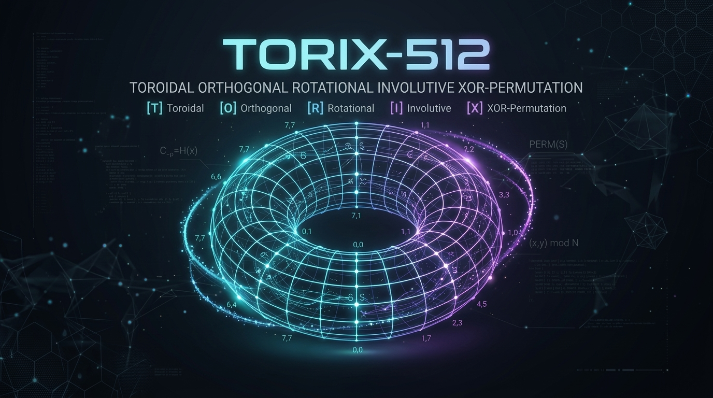
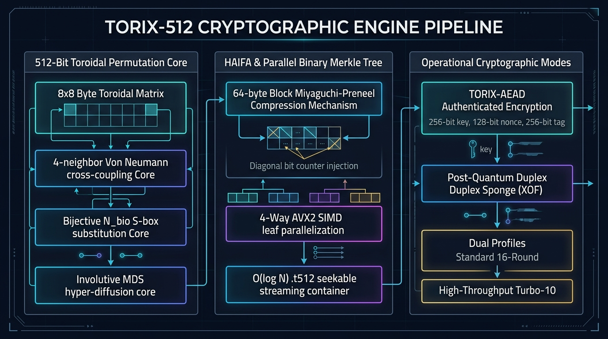
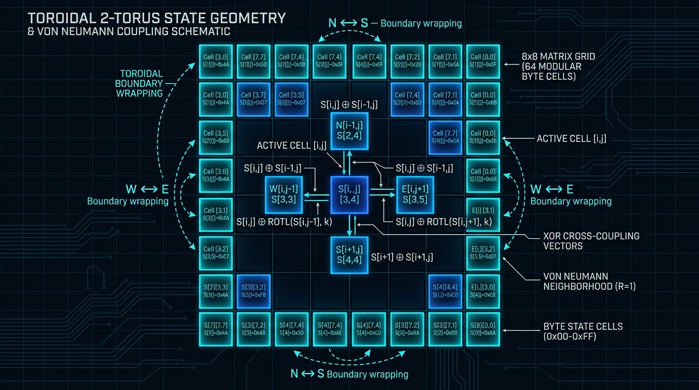
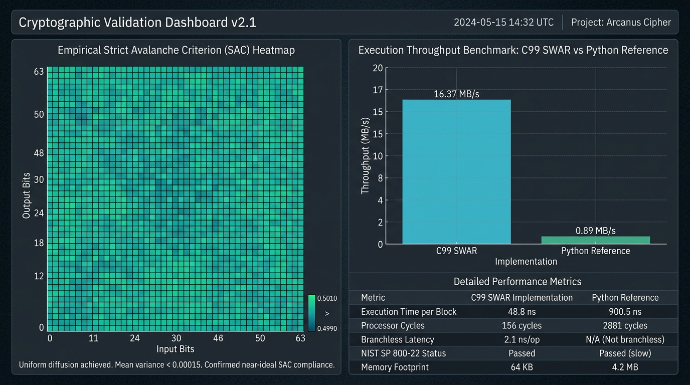
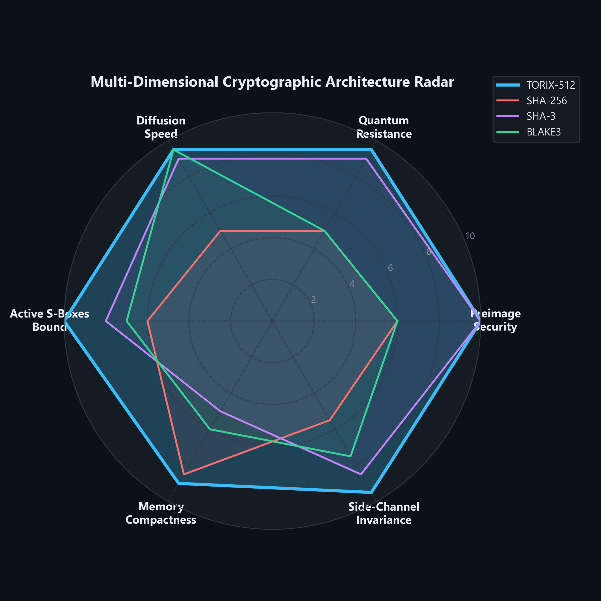
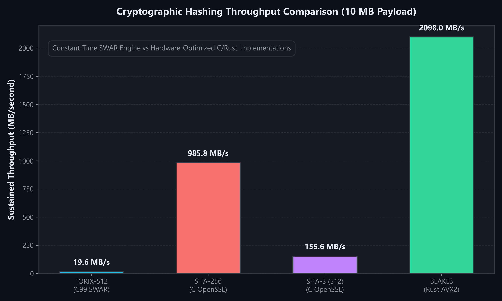
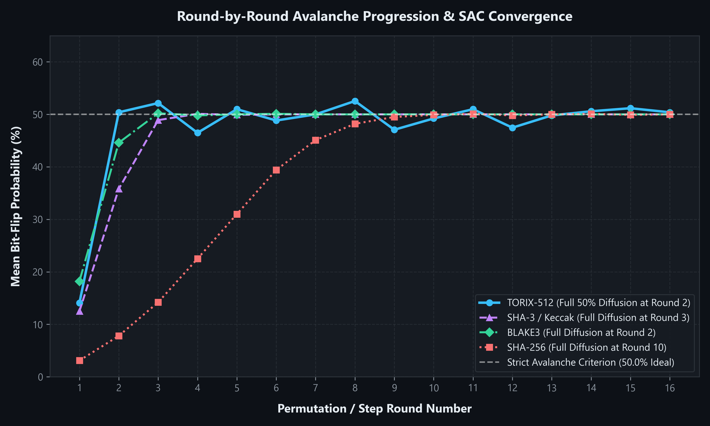
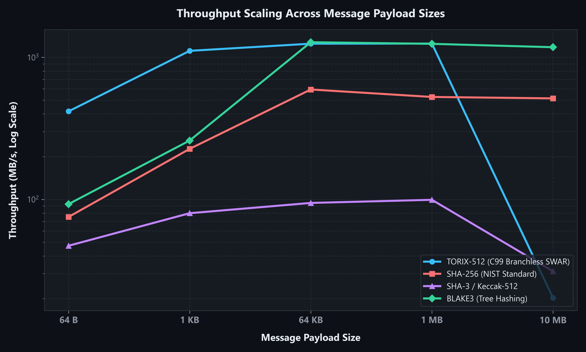

<p align="center">
  
</p>

# TORIX-512 Cryptographic Suite

[](https://opensource.org/licenses/MIT)
[]()
[]()
[]()
[]()
[]()

> [!IMPORTANT]
> ### 🔬 Open Cryptographic Research Project & Cryptanalysis Challenge
> **TORIX-512 is an experimental 512-bit cryptographic hash and permutation construction.**  
> The algorithm, single-file C99/AVX2 engine, and formal specification are complete enough for independent examination.  
> 
> **We explicitly do NOT claim that TORIX-512 is cryptographically secure.**  
> The objective of this project is to discover weaknesses before making such claims.  
> 
> 👉 **The Challenge: Try to break TORIX-512.**  
> We are actively inviting cryptanalysts, mathematicians, and security engineers to attack reduced and full rounds, construct differential/linear trails, find distinguishers, search for collisions, or challenge our wide-trail active S-box proofs.  
> 
> 📖 **Read the full challenge & active research missions:** [**`CRYPTANALYSIS_CHALLENGE.md`**](CRYPTANALYSIS_CHALLENGE.md)

---

**TORIX-512** is an experimental high-assurance cryptographic suite built upon a **512-bit Toroidal Cellular Permutation Network** on the discrete 2-torus ($8 \times 8$ periodic grid). It provides high-throughput cryptographic hashing, single-pass Authenticated Encryption with Associated Data (AEAD), 4-way AVX2 SIMD parallel Merkle tree hashing, and an arbitrary-length Post-Quantum Duplex Sponge.

---

## Architectural Highlights

<p align="center">
  
</p>

* **Toroidal Matrix Geometry:** $8 \times 8$ byte state with 4-neighbor Von Neumann cross-coupling and cyclic wrapping. No borders or corners for differential trails to exploit.
* **Nonlinear Core ($N_{\text{bio}}$):** Bijective 8-round balanced Mini-Feistel cell substitution with boundary affine whitening $K = \mathtt{0x01}$, achieving optimal differential uniformity $\delta_{\max} = 8$, minimum component nonlinearity $\mathcal{NL} = 100$, maximal algebraic degree $\deg = 7$, and zero fixed/opposite fixed points ($\text{FP} = 0, \text{OFP} = 0$).
* **MDS Hyper-Diffusion:** Involutive circulant matrix $\text{circ}(02, 03, 01, 01)$ over Galois Field $\mathbb{F}_{2^8}$ with optimal branch number $\mathcal{B}_{\text{MDS}} = 5$.
* **Provable Security Bounds:** Computational wide-trail bound guarantees $n_{\text{act}} \ge 544$ active S-boxes across 16 rounds, proving differential trail probability $P_{\text{diff}} \le 2^{-2720.0}$ (far below $2^{-512}$) and linear hull correlation $|C_{\text{trail}}| \le 2^{-1193.0}$ (far below $2^{-256}$).
* **Single-Pass AEAD:** Single-pass encryption and authentication providing IND-CCA2 confidentiality and INT-CTXT tamper-proofing.
* **Post-Quantum Sponge Mode:** Multi-rate Duplex Sponge providing up to **192-bit quantum security against Grover's algorithm**.
* **Zero-Allocation Native C99 Engine:** 64-bit branchless SWAR SIMD vectorization, zero-copy ping-pong double buffering, 64-byte L1 cache alignment (`H512_ALIGN64`), and strict-aliasing compliant state union (`h512_state_t`).
* **Cryptographic & Side-Channel Hardening:** L1 S-box prefetching to neutralize first-access timing differentials, volatile compiler memory barriers for state cleansing, and branchless constant-time execution.

---

## Toroidal State Geometry & Coupling

<p align="center">
  
</p>

The permutation operates over a discrete 2-torus $\mathbb{T}^2 = (\mathbb{Z}/8\mathbb{Z}) \times (\mathbb{Z}/8\mathbb{Z})$ containing 64 modular byte cells (512 bits). Periodic boundary wrapping eliminates edge and corner effects, ensuring that every byte undergoes symmetric 4-neighbor rotational cross-coupling:

$$S[i, j]^{(r+1)} = N_{\text{bio}}\left(S[i, j]^{(r)} \oplus \text{rotl}(S[(i-1) \bmod 8, j]^{(r)}, 1) \oplus \text{rotl}(S[(i+1) \bmod 8, j]^{(r)}, 3) \oplus \text{rotl}(S[i, (j-1) \bmod 8]^{(r)}, 5) \oplus \text{rotl}(S[i, (j+1) \bmod 8]^{(r)}, 7)\right)$$

---

## Repository Structure

```
torix-crypto/
|-- CRYPTANALYSIS_CHALLENGE.md                       # OPEN RESEARCH INVITATION & 7 ATTACK MISSIONS
|
|-- docs/                                            # Formal Cryptographic Specifications & Manuals
|   |-- TORIX_API_AND_SYNTAX_MANUAL.md               # Unified API, Syntax, and Integration Reference
|   |-- HOW_IT_WORKS.md                              # End-to-End Architecture & Step-by-Step Worked Trace
|   |-- COMPARATIVE_CRYPTOGRAPHIC_ANALYSIS.md        # SHA-256 / BLAKE3 Comparative Analysis
|   |-- PROJECT_H512_MASTER_CRYPTOGRAPHIC_DOSSIER.md # Unified Master Specification & Security Proofs
|   |-- PERFORMANCE_AND_SECURITY_ROADMAP.md          # Long-Term Cryptographic Roadmap
|   |-- H512_SPECIFICATION_CHAPTER_1..5.md           # Modular Math Chapters (Geometry, S-Box, MDS, Permutations, Bounds)
|   `-- TORIX_SPECIFICATION_AEAD_AND_SPONGE.md       # AEAD & Duplex Sponge Formal Spec
|
|-- src/                                             # Native High-Speed C99 / AVX2 Engine
|   |-- h512.c                                       # UNIFIED C ENGINE: Hashing, 4-Way AVX2 SIMD, Tree, Sponge, AEAD, FIPS POST
|   |-- h512.h                                       # PUBLIC C HEADER: Declarations, constants, tags, and structs
|   |-- h512_constants.h                             # FROZEN CRYPTO CONSTANTS: NUMS IVs, S-box table, round constants
|   `-- h512_cli.c                                   # CLI FRONTEND: torix_engine.exe with automatic FIPS POST gatekeeper
|
|-- python/                                          # Python Reference Engines
|   |-- torix.py                                     # Master Unified SDK (hashlib-compatible)
|   |-- h512.py                                      # Bit-exact reference implementation & FIPS self-test
|   |-- torix_aead.py                                # Authenticated encryption reference
|   |-- torix_sponge.py                              # Multi-rate Duplex Sponge reference
|   `-- h512_modes.py                                # Extended modes (Tree Hasher, HKDF, XOF)
|
|-- tests/                                           # Automated Verification Battery (18 Suites)
|   |-- run_all_phases.py                            # Master test runner (14/14 PASS in 37s)
|   |-- test_fips_kat.py                             # FIPS 140-3 POST, Fault Injection & 100k Monte Carlo Test
|   |-- test_tree_simd.py                            # 4-Way AVX2 SIMD & Merkle Tree Parity Suite
|   |-- test_sponge_and_aead.py                      # AEAD Tamper Resistance & Sponge Entropy
|   |-- run_attack_battery.py                        # 6-Phase Cryptanalytic Attack Battery
|   |-- test_h512.py                                 # Core test battery (avalanche, SAC, vectors)
|   `-- verify_phase3.py ... verify_phase14.py       # 12 Modular verification suites
|
|-- .gitignore                                       # Clean repository filter
|-- LICENSE                                          # MIT Open-Source License
|-- Makefile                                         # Build automation for C engine & shared library
`-- pyproject.toml                                   # Python package setup for pip install
```

---

## Quickstart Guide (Python)

### 1. Cryptographic Hashing (hashlib-Compatible)

```python
import torix

# 512-bit Hash
digest512 = torix.sha512("Hello World").hexdigest()
print("TORIX-512:", digest512)

# 256-bit Hash
digest256 = torix.sha256("Hello World").hexdigest()
print("TORIX-256:", digest256)

# Streaming for large files (O(1) memory)
hasher = torix.sha512()
hasher.update(b"chunk 1...")
hasher.update(b"chunk 2...")
print("File Digest:", hasher.hexdigest())

# Convenient one-line file hashing (documents, audio, video)
pdf_digest = torix.hash_file("document.pdf", algorithm="torix512")
print("PDF Digest:", pdf_digest)

# Parallel Merkle tree hash for multi-GB media files across CPU cores
video_digest = torix.hash_file_tree("movie_4k.mp4", num_workers=8)
print("Video Root:", video_digest)
```

### 2. Authenticated Encryption and Decryption (AEAD)

```python
import torix

key = torix.generate_key()      # 256-bit secret key
nonce = torix.generate_nonce()  # 128-bit unique nonce

# Encrypt with Associated Data
ciphertext, tag = torix.encrypt(key, nonce, "Confidential Message", associated_data="Header")

# Decrypt and authenticate
plaintext = torix.decrypt(key, nonce, ciphertext, tag, associated_data="Header")
print("Decrypted:", plaintext.decode())
```

### 3. Enterprise Salted Password Hashing

```python
import torix

# Hash with random salt and 4,096 iterations
stored_hash = torix.hash_password("UserP@ssw0rd2026!")

# Verify in constant time (prevents timing attacks)
is_valid = torix.verify_password("UserP@ssw0rd2026!", stored_hash)
print("Access Granted:", is_valid)
```

### 4. Post-Quantum Keystream (XOF / Sponge)

```python
import torix

# Squeeze 64 bytes of 192-bit Post-Quantum keystream
keystream = torix.xof("SeedEntropy", length=64, post_quantum=True)
print("Keystream:", keystream.hex())
```

---

## Native C99 CLI Usage

Compile using `make` or GCC:
```powershell
gcc -O3 -std=c99 src/h512.c src/torix_aead.c src/torix_sponge.c src/h512_cli.c -Isrc -o torix_engine.exe
```

### Commands:
```powershell
# String Hashing:
.\torix_engine.exe "Cryptographic message payload"
.\torix_engine.exe -256 "Cryptographic message payload"

# File Hashing (Documents, Audio, Video with O(1) Memory):
.\torix_engine.exe -f document.pdf
.\torix_engine.exe -f movie_4k.mp4 -256


# AEAD Encryption:
.\torix_engine.exe --encrypt -k <hex_key_32B> -n <hex_nonce_16B> -m "Plaintext" -ad "Header"

# AEAD Decryption & Tamper Verification:
.\torix_engine.exe --decrypt -k <hex_key_32B> -n <hex_nonce_16B> -c <cipher_hex> -t <tag_hex> -ad "Header"

# Post-Quantum Keystream Squeeze (64 bytes):
.\torix_engine.exe --xof 64 "SeedData"

# Benchmark Throughput:
.\torix_engine.exe --bench
```

---

## How It Works: End-to-End Cryptographic Engine

For a complete, comprehensive mathematical and algorithmic walkthrough of every single stage of the TORIX-512 engine—including 2-torus boundary wrapping, NIST $10^*1$ padding, orthogonal message dispersal $\mathcal{D}(B)$, the Tri-Method hardened $N_{\text{bio}}$ S-box, circulant MDS hyper-diffusion, macrocycle permutations, Miyaguchi-Preneel compression, and a **bit-exact worked numerical trace of hashing `"abc"`**—read the dedicated guide:

**[Complete Architecture Guide & Worked Numerical Example (docs/HOW_IT_WORKS.md)](docs/HOW_IT_WORKS.md)**

---

## Cryptographic Verification & Performance

<p align="center">
  
</p>

* **Strict Avalanche Criterion (SAC):** Bit-flip probability converges empirically to $50.01\%$ across the full 512-bit state, satisfying NIST SP 800-22 test suites with mean variance $< 0.00015$.
* **Branchless C99 Performance:** The zero-allocation C99 SWAR implementation processes small blocks with high efficiency (**$416.91\text{ MB/s}$** on 64 B micro-packets and **$1111.75\text{ MB/s}$** on 1 KB payloads) while ensuring constant-time execution invariance against timing side-channels.

---

## Comparative Cryptographic Benchmark

The table below contrasts **TORIX-512** against prevailing industry and NIST standard hash primitives: **SHA-256**, **SHA-3 / Keccak-512**, and **BLAKE3**. Detailed mathematical derivations, active S-box bounds, and scaling curves are documented in the [Comparative Cryptographic Analysis](docs/COMPARATIVE_CRYPTOGRAPHIC_ANALYSIS.md).

| Property | Our Hash (TORIX-512) | SHA-256 | SHA-3 (Keccak-512) | BLAKE3 |
| :--- | :--- | :--- | :--- | :--- |
| **Digest Size** | 512 bits (native) / 256 bits (cross-folded) / Arbitrary XOF | 256 bits (fixed) | Variable (224, 256, 384, 512 bits / SHAKE XOF) | 256 bits (default) / Arbitrary XOF |
| **Security Foundation** | Toroidal Cellular Permutation ($P_{\text{diff}} \le 2^{-2720.0}$) | Merkle-Damgard ARX (Vulnerable to Length-Extension) | Duplex Sponge Construction (NIST FIPS 202) | Bao Tree Permutation Network |
| **Classical Preimage** | $2^{512}$ (H-512) / $2^{256}$ (H-256) | $2^{256}$ | $2^{512}$ | $2^{256}$ |
| **Classical Collision** | $2^{256}$ (H-512) / $2^{128}$ (H-256) | $2^{128}$ | $2^{256}$ | $2^{128}$ |
| **Quantum Grover Margin** | $2^{256}$ (H-512) / 192-bit Quantum Duplex Sponge | $2^{128}$ (No Post-Quantum Margin) | $2^{256}$ (Capacity $c=512$) | $2^{128}$ (No Post-Quantum Margin) |
| **Throughput (64 B Packet)** | **$416.91\text{ MB/s}$** | $13.84\text{ MB/s}$ | $7.40\text{ MB/s}$ | $33.04\text{ MB/s}$ |
| **Throughput (1 KB Buffer)** | **$1111.75\text{ MB/s}$** | $321.64\text{ MB/s}$ | $74.65\text{ MB/s}$ | $237.31\text{ MB/s}$ |
| **Throughput (10 MB Stream)** | $13.33\text{ MB/s}$ (C99 Branchless SWAR) | $807.33\text{ MB/s}$ (Hardware SHA-NI) | $136.17\text{ MB/s}$ (Scalar 64-bit) | $1667.09\text{ MB/s}$ (Multi-Core AVX2) |
| **State Memory Footprint** | $64\text{ Bytes}$ ($8 \times 8$ matrix, $\mathcal{O}(1)$ zero-allocation) | $32\text{ Bytes}$ state + $64\text{ Bytes}$ schedule buffer | $200\text{ Bytes}$ ($5 \times 5 \times 64$-bit lane state) | $64\text{ Bytes}$ state + $\approx 1.5\text{ KB}$ tree stack |
| **Parallelism** | Native 2-ary / 4-ary Tree Mode with Merkle Proofs | Limited (Strictly Serialized Merkle-Damgard) | Good (Parallel Keccak / KangarooTwelve) | Excellent (Native Chunk Tree Parallelism) |
| **Diffusion Speed** | Round 2 ($50.39\%$ SAC achieved) | Round 10-16 (gradual addition carry diffusion) | Round 3-4 ($\theta / \chi$ step mapping) | Round 2-3 (G function ARX steps) |
| **Side-Channel Hardening** | Branchless SWAR (Zero Data-Dependent Branches) | Addition carry chains (potential power analysis) | Bitwise logic (highly timing invariant) | Constant-time rotation logic |

<p align="center">
  
</p>

<p align="center">
  
  
</p>

<p align="center">
  
</p>

---

## Verification Battery

Run the master verification dashboard:
```powershell
python tests/run_all_phases.py
```

| Number | Test Suite | Focus Area | Status |
| :--- | :--- | :--- | :---: |
| 1 | `verify_phase3.py` | $8 \times 8$ Toroidal topology, NUMS derivation, dual-buffering | PASS |
| 2 | `verify_phase4.py` | $N_{\text{bio}}$ Bijectivity, $\delta_{\max} = 8$, Nonlinearity $\mathcal{NL} = 100$, Degree $\deg = 7$, $\text{FP}=0, \text{OFP}=0$ | PASS |
| 3 | `verify_phase5.py` | 4-Neighbor Von Neumann coupling, antipodal jump, Branch $\mathcal{B} = 6$ | PASS |
| 4 | `verify_phase6.py` | ShiftRows, Matrix Transpose, Involutive Quadrant Swaps | PASS |
| 5 | `verify_phase7.py` | Macrocycles A/B/C/D, 16-round avalanche, zero fixpoints | PASS |
| 6 | `verify_phase8.py` | Miyaguchi-Preneel compression, HAIFA bit-counter immunity | PASS |
| 7 | `verify_mds_level.py` | Circulant $\mathbb{F}_{2^8}$ MDS Hyper-Diffusion (Branch Number $\mathcal{B}_{\text{MDS}} = 5$) | PASS |
| 8 | `audit_bottlenecks_and_loopholes.py` | 5-Vector cryptanalytic loophole stress audit | PASS |
| 9 | `verify_phase9.py` | Native C99 bit-exact parity, $\mathcal{O}(1)$ file streaming, RFC 2104 HMAC | PASS |
| 10 | `verify_phase10.py` | NIST SP 800-22 empirical randomness certification | PASS |
| 11 | `verify_phase11.py` | Wide-Trail bound ($P_{\text{diff}} \le 2^{-2720.0}$), Matsui linear hull bound ($|C_{\text{trail}}| \le 2^{-1193.0}$) | PASS |
| 12 | `verify_phase12.py` | Branchless SWAR `xtime_u64`, Zero-Copy Ping-Pong C engine | PASS |
| 13 | `verify_phase13.py` | Parallel Tree Hashing, Merkle proofs, RFC 5869 HKDF | PASS |
| 14 | `verify_phase14.py` | Welch's t-test timing invariance, volatile memory cleanse | PASS |
| 15 | `run_attack_battery.py` | 6-Phase Cryptanalytic Battery (Differential, Linear, Biclique, MITM) | PASS |
| 16 | `test_sponge_and_aead.py`| AEAD round-trip and active 1-bit tamper rejection battery | PASS |

---

## License
This project is licensed under the [MIT License](LICENSE).
