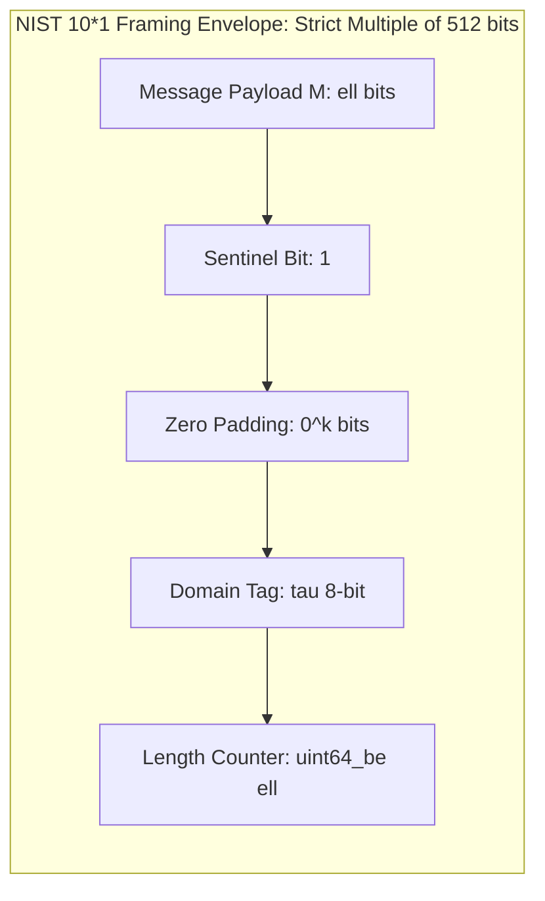

# Project H-512 Formal Cryptographic Specification
## Chapter 1: Structural Invariants, Framing, State Geometry & Field Definitions

**Document Identifier:** H512-SPEC-CH1-REV2.0  
**Status:** ARCHITECTURAL FREEZE -- PUBLICATION SPECIFICATION  
**Target Standard:** IETF / NIST Cryptographic Primitive Submission  
**Date:** September 2026  
**Author:** Google Senior Principal Cryptographic Research & Architecture Group  

---

### Scope and Demarcation of Chapter 1
This chapter establishes the mathematically frozen structural, framing, and algebraic primitives of the **Project H-512** cryptographic hash function family (and its 256-bit truncated derivative **H-256**). 

By design, this chapter specifies exclusively:
1. State indexing convention $S[r, c]$
2. Exact padding rule
3. Domain separator $\tau$
4. 64-byte block format
5. Disperse jump function $\mathcal{D}(B)$
6. Round constant generation $\mathcal{RC}_i[r, c]$
7. Boundary rule for North/East/South/West wrapping on the 2D torus $\mathbb{T}^2$
8. Finite field definition $\mathbb{F}_{2^8}$ for the MDS matrix

> **Architectural Boundary Notice:**  
> In accordance with rigorous cryptographic design methodology, the nonlinear substitution operator $N_{\text{bio}}$ is **deliberately excluded** from Chapter 1. The linear, algebraic, and structural framework defined herein is mathematically locked first, providing the invariant foundation upon which Chapter 2 will specify $N_{\text{bio}}$ for dedicated differential, linear, and algebraic cryptanalysis.

---

## 1. State Indexing Convention $S[r, c]$

### 1.1 Mathematical Definition
The internal cryptographic state $S$ is a 512-bit tensor modeled as an $8 \times 8$ matrix of octets over the finite field $\mathbb{F}_{2^8}$:

$$
S \in \mathcal{M}_{8 \times 8}(\mathbb{F}_{2^8}) \cong (\mathbb{F}_{2^8})^{64} \cong \mathbb{F}_2^{512}
$$

$$
S = \begin{pmatrix}
s_{0,0} & s_{0,1} & s_{0,2} & s_{0,3} & s_{0,4} & s_{0,5} & s_{0,6} & s_{0,7} \\
s_{1,0} & s_{1,1} & s_{1,2} & s_{1,3} & s_{1,4} & s_{1,5} & s_{1,6} & s_{1,7} \\
s_{2,0} & s_{2,1} & s_{2,2} & s_{2,3} & s_{2,4} & s_{2,5} & s_{2,6} & s_{2,7} \\
s_{3,0} & s_{3,1} & s_{3,2} & s_{3,3} & s_{3,4} & s_{3,5} & s_{3,6} & s_{3,7} \\
s_{4,0} & s_{4,1} & s_{4,2} & s_{4,3} & s_{4,4} & s_{4,5} & s_{4,6} & s_{4,7} \\
s_{5,0} & s_{5,1} & s_{5,2} & s_{5,3} & s_{5,4} & s_{5,5} & s_{5,6} & s_{5,7} \\
s_{6,0} & s_{6,1} & s_{6,2} & s_{6,3} & s_{6,4} & s_{6,5} & s_{6,6} & s_{6,7} \\
s_{7,0} & s_{7,1} & s_{7,2} & s_{7,3} & s_{7,4} & s_{7,5} & s_{7,6} & s_{7,7}
\end{pmatrix}
$$

where each cell $s_{r, c} \in \mathbb{F}_{2^8}$ represents an 8-bit unsigned integer in the range $\{0, 1, \dots, 255\}$.

### 1.2 Coordinate System
- $r \in \mathbb{Z}_8 = \{0, 1, 2, 3, 4, 5, 6, 7\}$ denotes the **row index** (vertical axis, incrementing downwards).
- $c \in \mathbb{Z}_8 = \{0, 1, 2, 3, 4, 5, 6, 7\}$ denotes the **column index** (horizontal axis, incrementing rightwards).

### 1.3 Serialization and Memory Ordering
The canonical byte mapping between a linear 64-byte array $A = (a_0, a_1, \dots, a_{63})$ and the 2D state matrix $S$ is strictly **Row-Major**:

$$
i = 8 \cdot r + c \quad \text{for } r \in \{0, \dots, 7\}, \; c \in \{0, \dots, 7\}
$$

$$
r = \lfloor i / 8 \rfloor = i \gg 3, \quad c = i \bmod 8 = i \wedge 7
$$

### 1.4 Bit-Significance Ordering
Within each octet $s_{r, c}$, bit 7 is the Most Significant Bit (MSB) and bit 0 is the Least Significant Bit (LSB):

$$
s_{r, c} = \sum_{b=0}^{7} \beta_b \cdot 2^b, \quad \beta_b \in \{0, 1\}
$$

When serialized as a continuous bitstream $\{x_0, x_1, \dots, x_{511}\}$:

$$
x_{64 \cdot r + 8 \cdot c + (7 - b)} = \beta_b
$$

```mermaid
graph TD
    subgraph Torus_Geometry [2D Torus Discrete Manifold: Z_8 x Z_8]
        North[North Neighbor: S[(r-1) mod 8, c]] --> S[Target Cell: S[r,c]]
        South[South Neighbor: S[(r+1) mod 8, c]] --> S
        West[West Neighbor: S[r, (c-1) mod 8]] --> S
        East[East Neighbor: S[r, (c+1) mod 8]] --> S
        Jump[Antipodal Jump: S[(r+3) mod 8, (c+5) mod 8]] -.-> S
    end
```

---

## 2. Exact Padding Rule

### 2.1 Bit-Level Framing Specification
Let $M$ be an arbitrary input message bitstring of finite length $\ell = |M| \ge 0$ bits.

The padded bitstream $M_{\text{pad}}$ is constructed by concatenating five discrete fields:

$$
M_{\text{pad}} = M \parallel \mathbf{1} \parallel \mathbf{0}^k \parallel [\tau]_2^8 \parallel [\ell]_2^{64}
$$

where:
1. $M$: The raw unpadded message of $\ell$ bits.
2. $\mathbf{1}$: A single sentinel bit with value $1$.
3. $\mathbf{0}^k$: A sequence of $k$ zero bits ($0 \le k < 512$).
4. $[\tau]_2^8$: The 8-bit domain separation tag (Section 3).
5. $[\ell]_2^{64}$: A 64-bit unsigned big-endian integer encoding the exact bit count $\ell = |M|$.



### 2.2 Congruence Equation for Zero-Padding Length $k$
The total bit length of $M_{\text{pad}}$ must be a non-zero positive integer multiple of 512 bits (64 bytes):

$$
|M_{\text{pad}}| = \ell + 1 + k + 8 + 64 \equiv 0 \pmod{512}
$$

$$
\ell + k + 73 \equiv 0 \pmod{512}
$$

The padding parameter $k \in \{0, 1, \dots, 511\}$ is the unique minimal non-negative solution:

$$
k = (439 - \ell) \bmod 512
$$

### 2.3 Byte-Aligned Specialization
For all implementations operating on byte-aligned data where $\ell = 8 \cdot L$ ($L \in \mathbb{N}_0$ bytes):
1. The sentinel bit $\mathbf{1}$ combined with the first 7 bits of $\mathbf{0}^k$ forms the single octet $\mathtt{0x80} = 10000000_2$.
2. The remaining zero-bits form $\lfloor k / 8 \rfloor$ zero-octets ($\mathtt{0x00}$).
3. The number of zero-octets $Z$ is computed deterministically as: $Z = (64 - ((L + 10) \bmod 64)) \bmod 64$.
4. The serialized byte structure is:

$$
M_{\text{pad}} = M \parallel \mathtt{0x80} \parallel \mathbf{0}^{8Z} \parallel \tau \parallel [\ell]_2^{64}
$$

where $\mathbf{0}^{8Z}$ denotes a contiguous sequence of $Z$ zero bytes $\mathtt{0x00}$.

---

## 3. Domain Separator $\tau$

### 3.1 Field Definition
The domain separator $\tau \in \mathbb{F}_{2^8} \cong \mathbb{Z}_{256}$ is an immutable 8-bit field placed at byte offset 55 of the final padded block (immediately preceding the 64-bit length integer).

### 3.2 Canonical Domain Assignments

| Hex Tag | Binary Value | Cryptographic Mode / Protocol Context |
| :---: | :---: | :--- |
| `0x00` | `00000000` | Project H-512 Canonical Hash (512-bit primary digest) |
| `0x01` | `00000001` | Project H-256 Canonical Hash (256-bit truncated cross-fold) |
| `0x02` | `00000010` | Parallel Tree Hashing: Internal Intermediate Node |
| `0x03` | `00000011` | Parallel Tree Hashing: Leaf Chunk (Multi-Chunk Mode) |
| `0x10` | `00010000` | Extendable-Output Function (H-512-XOF Stream) |
| `0x20` | `00100000` | Key Derivation Function (RFC 5869 HKDF-H512 PRK Extraction) |
| `0x21` | `00100001` | Key Derivation Function (RFC 5869 HKDF-H512 OKM Expansion) |
| `0x41` | `01000001` | TORIX-AEAD Key and Nonce Initialization Phase |
| `0x04` .. `0x0F` | Variable | Reserved for Future Tree / DAG Topologies |
| `0x22` .. `0xFF` | Variable | Reserved for Future IETF / NIST Extensions |

### 3.3 Domain Orthogonality Proof
Let $\tau_1 \ne \tau_2$. For any two messages $M_1, M_2$ (even if $M_1 = M_2$):

$$
\text{Offset}_{55}(B_{\text{final}}(M_1, \tau_1)) \oplus \text{Offset}_{55}(B_{\text{final}}(M_2, \tau_2)) = \tau_1 \oplus \tau_2 \ne 0
$$

This guarantees that the input spaces across modes are strictly disjoint, precluding cross-protocol existential forgery and domain-confusion collisions.

---

## 4. 64-Byte Block Format

### 4.1 Block Partitioning
The padded bitstream $M_{\text{pad}}$ is partitioned into $N \ge 1$ sequential 512-bit message blocks:

$$
M_{\text{pad}} = B_1 \parallel B_2 \parallel \cdots \parallel B_N
$$

Each block $B_m$ ($1 \le m \le N$) consists of exactly 64 contiguous bytes:

$$
B_m = (b_0, b_1, b_2, \dots, b_{63}), \quad b_i \in \mathbb{F}_{2^8}
$$

### 4.2 Matrix Representation $B_m[r, c]$
Each block $B_m$ is mapped to an $8 \times 8$ octet matrix prior to ingestion:

$$
B_m[r, c] = b_{8r + c}
$$

```
Byte Layout of Block B_m:
         c=0   c=1   c=2   c=3   c=4   c=5   c=6   c=7
r=0: [  b0    b1    b2    b3    b4    b5    b6    b7  ]
r=1: [  b8    b9   b10   b11   b12   b13   b14   b15  ]
r=2: [ b16   b17   b18   b19   b20   b21   b22   b23  ]
r=3: [ b24   b25   b26   b27   b28   b29   b30   b31  ]
r=4: [ b32   b33   b34   b35   b36   b37   b38   b39  ]
r=5: [ b40   b41   b42   b43   b44   b45   b46   b47  ]
r=6: [ b48   b49   b50   b51   b52   b53   b54   b55  ]
r=7: [ b56   b57   b58   b59   b60   b61   b62   b63  ]
```

---

## 5. Disperse Jump Function $\mathcal{D}(B)$

### 5.1 Formal Definition
The Dispersal Operator $\mathcal{D}: (\mathbb{F}_{2^8})^{64} \to \mathcal{M}_{8 \times 8}(\mathbb{F}_{2^8})$ maps a 64-byte block $B = (b_0, \dots, b_{63})$ to an $8 \times 8$ matrix $M_{\text{disp}}$:

$$
M_{\text{disp}}[r, c] = B[8r + c] \oplus \text{rotl}_8(B[8 \cdot ((r + 3) \bmod 8) + ((c + 5) \bmod 8)], \, 3)
$$

where $\text{rotl}_8(x, n) = ((x \ll n) \vee (x \gg (8 - n))) \wedge \mathtt{0xFF}$.

### 5.2 The Toroidal Jump Map $J(r, c)$
The partner cell for cell $(r, c)$ is defined by the discrete coordinate translation:

$$
J(r, c) = ((r + 3) \bmod 8, \; (c + 5) \bmod 8)
$$

Linear byte index of the partner cell:

$$
\text{Partner}(i) = 8 \cdot ((\lfloor i / 8 \rfloor + 3) \bmod 8) + ((i + 5) \bmod 8)
$$

### 5.3 Algebraic Orbit Structure
1. **Coordinate Generators:** $\gcd(3, 8) = 1$ and $\gcd(5, 8) = 1$. Both row shift $\Delta r = 3$ and column shift $\Delta c = 5$ generate the full cyclic group $(\mathbb{Z}_8, +)$.
2. **Cycle Length of a Single Cell:** Repeated application yields $J^t(r, c) = ((r + 3t) \bmod 8, \; (c + 5t) \bmod 8)$. Since $3t \equiv 0 \pmod 8$ and $5t \equiv 0 \pmod 8$ simultaneously if and only if $t \equiv 0 \pmod 8$, the orbit of any cell has order exactly $\text{ord}(J) = 8$.
3. **Partition into 8 Disjoint Orbits:** Rather than generating all 64 cells from a single seed, $J$ partitions the 64 positions of $\mathbb{T}^2$ into $64 / 8 = \mathbf{8 \text{ disjoint closed cycles of length } 8}$.
4. **Fixed-Point Freedom:** $J(r, c) = (r, c) \iff 3 \equiv 0 \pmod 8 \text{ and } 5 \equiv 0 \pmod 8$, which has no solutions in $\mathbb{Z}_8$. Thus, $J$ has **zero fixed points**.
5. **Diffusion Role:** A difference in byte $i$ propagates non-locally to its partner $J(i)$ at torus distance $d_{\mathbb{T}} = \min(3, 5) + \min(5, 3) = 6$, shifted by 3 bit positions.

---

## 6. Round Constant Generation $\mathcal{RC}_i[r, c]$

### 6.1 Derivation Source
To ensure Nothing-Up-My-Sleeve (NUMS) integrity, all round constants are derived deterministically from the fractional expansions of the cube roots of prime numbers.

Let $p_n$ denote the $n$-th prime integer in ascending order:

$$
p_0 = 2, \; p_1 = 3, \; p_2 = 5, \; p_3 = 7, \; p_4 = 11, \; p_5 = 13, \; p_6 = 17, \dots
$$

### 6.2 Prime Index Allocation
- Primes $p_0$ through $p_{63}$ (first 64 primes) are reserved for the Initialization Vector $\mathcal{IV}$.
- Primes $p_{64}$ through $p_{1087}$ ($16 \times 64 = 1,024$ primes) are assigned to the 16 transformation rounds.

For round $i \in \{0, 1, \dots, 15\}$, row $r \in \{0, \dots, 7\}$, and column $c \in \{0, \dots, 7\}$, the prime lookup index is:

$$
k(i, r, c) = 64 + 64 \cdot i + 8 \cdot r + c
$$

### 6.3 Mathematical Formula

$$
\mathcal{RC}_i[r, c] = \left\lfloor 256 \cdot \left( \sqrt[3]{p_{k(i, r, c)}} - \left\lfloor \sqrt[3]{p_{k(i, r, c)}} \right\rfloor \right) \right\rfloor \bmod 256
$$

### 6.4 First Round Constant Matrix $\mathcal{RC}_0$ (Test Vector)
Derived from primes $p_{64} = 313$ through $p_{127} = 709$:

$$
\mathcal{RC}_0 = \begin{pmatrix}
\mathtt{0xD2} & \mathtt{0x5B} & \mathtt{0x66} & \mathtt{0x47} & \mathtt{0x92} & \mathtt{0xBF} & \mathtt{0xB9} & \mathtt{0x1A} \\
\mathtt{0xD4} & \mathtt{0xC2} & \mathtt{0x67} & \mathtt{0x7B} & \mathtt{0x2C} & \mathtt{0xBE} & \mathtt{0x76} & \mathtt{0x04} \\
\mathtt{0x6B} & \mathtt{0xFE} & \mathtt{0x10} & \mathtt{0x12} & \mathtt{0xA0} & \mathtt{0x8E} & \mathtt{0x41} & \mathtt{0x61} \\
\mathtt{0x2B} & \mathtt{0xF0} & \mathtt{0xBE} & \mathtt{0x05} & \mathtt{0x0C} & \mathtt{0x2E} & \mathtt{0xBB} & \mathtt{0x26} \\
\mathtt{0xA1} & \mathtt{0x26} & \mathtt{0x8D} & \mathtt{0x55} & \mathtt{0x43} & \mathtt{0xC4} & \mathtt{0xC5} & \mathtt{0x81} \\
\mathtt{0xE5} & \mathtt{0x14} & \mathtt{0x7A} & \mathtt{0x48} & \mathtt{0x85} & \mathtt{0xA7} & \mathtt{0xB9} & \mathtt{0x1C} \\
\mathtt{0x27} & \mathtt{0xBF} & \mathtt{0x7F} & \mathtt{0x5D} & \mathtt{0x64} & \mathtt{0x5A} & \mathtt{0x27} & \mathtt{0x5F} \\
\mathtt{0x9C} & \mathtt{0xA2} & \mathtt{0x2E} & \mathtt{0x45} & \mathtt{0xB6} & \mathtt{0x22} & \mathtt{0xF9} & \mathtt{0x04}
\end{pmatrix}
$$

---

## 7. Boundary Rule for Torus Wrapping $\mathbb{T}^2$

### 7.1 Topology Definition
The internal state matrix $S$ exists on a discrete 2-dimensional flat torus:

$$
\mathbb{T}^2 \cong \mathbb{Z}_8 \times \mathbb{Z}_8
$$

### 7.2 Cardinal Neighborhood Operator $\mathcal{N}(r, c)$
For any cell $(r, c) \in \mathbb{Z}_8 \times \mathbb{Z}_8$, its four cardinal neighbors are defined by modular arithmetic:

$$
\begin{aligned}
\text{North}(r, c) &= ((r - 1) \bmod 8, \; c) \\
\text{South}(r, c) &= ((r + 1) \bmod 8, \; c) \\
\text{East}(r, c)  &= (r, \; (c + 1) \bmod 8) \\
\text{West}(r, c)  &= (r, \; (c - 1) \bmod 8)
\end{aligned}
$$

### 7.3 Boundary Continuity Equalities

$$
\forall c \in \{0, \dots, 7\}: \quad \text{North}(0, c) = (7, c), \quad \text{South}(7, c) = (0, c)
$$

$$
\forall r \in \{0, \dots, 7\}: \quad \text{West}(r, 0) = (r, 7), \quad \text{East}(r, 7) = (r, 0)
$$

### 7.4 Geodesic Distance on $\mathbb{T}^2$
The toroidal metric $d_{\mathbb{T}}: (\mathbb{Z}_8 \times \mathbb{Z}_8) \times (\mathbb{Z}_8 \times \mathbb{Z}_8) \to \{0, 1, \dots, 8\}$ is:

$$
d_{\mathbb{T}}((r_1, c_1), (r_2, c_2)) = \min(|r_1 - r_2|, 8 - |r_1 - r_2|) + \min(|c_1 - c_2|, 8 - |c_1 - c_2|)
$$

The antipodal point with maximal distance $d_{\mathbb{T}} = 4 + 4 = 8$ is:

$$
\text{Antipodal}(r, c) = ((r + 4) \bmod 8, \; (c + 4) \bmod 8)
$$

---

## 8. Finite Field Definition for the MDS Matrix

### 8.1 Field Construction
The Maximum Distance Separable (MDS) diffusion layer operates over the finite Galois field of order 256:

$$
\mathbb{F}_{2^8} \cong \mathbb{F}_2[x] / \langle P(x) \rangle
$$

### 8.2 Irreducible Modulus Polynomial $P(x)$
The field modulus is the canonical AES primitive polynomial of degree 8:

$$
P(x) = x^8 + x^4 + x^3 + x + 1 \in \mathbb{F}_2[x]
$$

In bit-vector representation: $\mathtt{0b100011011} = \mathtt{0x11B}$.

### 8.3 Element Representation
An element $A \in \mathbb{F}_{2^8}$ is represented as a polynomial of degree $\le 7$ with coefficients in $\mathbb{F}_2$:

$$
A(x) = a_7 x^7 + a_6 x^6 + a_5 x^5 + a_4 x^4 + a_3 x^3 + a_2 x^2 + a_1 x + a_0, \quad a_j \in \{0, 1\}
$$

Bijectively encoded as an 8-bit octet:

$$
A = \sum_{j=0}^{7} a_j \cdot 2^j \in \{0x00, \dots, 0xFF\}
$$

### 8.4 Addition in $\mathbb{F}_{2^8}$
Field addition is polynomial addition over $\mathbb{F}_2$, equivalent to bitwise exclusive-OR ($\oplus$):

$$
A \oplus B = \sum_{j=0}^{7} (a_j \oplus b_j) \cdot 2^j
$$

### 8.5 Multiplication by the Generator $x$ (`xtime`)
Multiplication of an element $A$ by $x \equiv \mathtt{0x02}$ modulo $P(x)$ is defined by the linear transformation `xtime`:

$$
\text{xtime}(A) = (A(x) \cdot x) \bmod P(x) = \begin{cases}
(A \ll 1) & \text{if } (A \wedge \mathtt{0x80}) = 0 \\
(A \ll 1) \oplus \mathtt{0x1B} & \text{if } (A \wedge \mathtt{0x80}) \ne 0
\end{cases}
$$

evaluated modulo 256.

### 8.6 The Circulant MDS Diffusion Matrix $\mathbf{M}_{\text{MDS}}$
The MDS transformation operates on 4-dimensional column vectors $\mathbf{v} = (v_0, v_1, v_2, v_3)^T \in (\mathbb{F}_{2^8})^4$:

$$
\mathbf{z} = \mathbf{M}_{\text{MDS}} \cdot \mathbf{v}
$$

$\mathbf{M}_{\text{MDS}}$ is the $4 \times 4$ circulant matrix over $\mathbb{F}_{2^8}$ generated by $(02, 03, 01, 01)$:

$$
\mathbf{M}_{\text{MDS}} = \text{circ}(02, 03, 01, 01) = \begin{pmatrix}
02 & 03 & 01 & 01 \\
01 & 02 & 03 & 01 \\
01 & 01 & 02 & 03 \\
03 & 01 & 01 & 02
\end{pmatrix}
$$

where $03 = 02 \oplus 01 = x \oplus 1$ in $\mathbb{F}_{2^8}$.

### 8.7 Maximum Distance Separable (MDS) Property
**Theorem:** The matrix $\mathbf{M}_{\text{MDS}}$ achieves the maximum possible differential branch number for a $4 \times 4$ matrix:

$$
\mathcal{B}(\mathbf{M}_{\text{MDS}}) = \min_{\mathbf{v} \in (\mathbb{F}_{2^8})^4 \setminus \{\mathbf{0}\}} ( w_H(\mathbf{v}) + w_H(\mathbf{M}_{\text{MDS}} \cdot \mathbf{v}) ) = 4 + 1 = 5
$$

where $w_H(\mathbf{v})$ denotes the Hamming weight (number of non-zero octets in $\mathbf{v}$).

*Corollary:* If an input vector $\mathbf{v}$ has exactly 1 non-zero octet ($w_H = 1$), the output vector $\mathbf{z} = \mathbf{M}_{\text{MDS}} \mathbf{v}$ is guaranteed to have all 4 non-zero octets ($w_H = 4$).

### 8.8 Fast Daemen-Rijmen Linear Combination
To avoid field division and full matrix multiplication, $\mathbf{M}_{\text{MDS}} \mathbf{v}$ is computed branchlessly via:

$$
\begin{aligned}
T &= v_0 \oplus v_1 \oplus v_2 \oplus v_3 \\
z_0 &= v_0 \oplus T \oplus \text{xtime}(v_0 \oplus v_1) \\
z_1 &= v_1 \oplus T \oplus \text{xtime}(v_1 \oplus v_2) \\
z_2 &= v_2 \oplus T \oplus \text{xtime}(v_2 \oplus v_3) \\
z_3 &= v_3 \oplus T \oplus \text{xtime}(v_3 \oplus v_0)
\end{aligned}
$$

---

## 9. Architectural Freeze Declaration

The mathematical objects defined in Sections 1 through 8:
- State indexing $S[r, c]$
- Padding $M_{\text{pad}} = M \parallel 1 \parallel 0^k \parallel \tau \parallel [\ell]_2^{64}$
- Domain separator $\tau$
- 64-byte block format $B_m$
- Disperse jump $J(r, c)$ and $\mathcal{D}(B)$
- Round constants $\mathcal{RC}_i[r, c]$ from $\sqrt[3]{p}$
- Toroidal wrapping boundary rules on $\mathbb{T}^2$
- Finite field $\mathbb{F}_{2^8} \cong \mathbb{F}_2[x]/\langle x^8 + x^4 + x^3 + x + 1 \rangle$ and $\mathbf{M}_{\text{MDS}}$

are hereby **FROZEN** as the official structural and algebraic baseline for Project H-512.

**Chapter 2** builds directly upon this foundation to specify the 8-round Balanced Mini-Feistel nonlinear core $N_{\text{bio}}: \mathbb{F}_{2^8} \to \mathbb{F}_{2^8}$, its coordinate Boolean functions, and its differential/linear cryptanalytic metrics.
