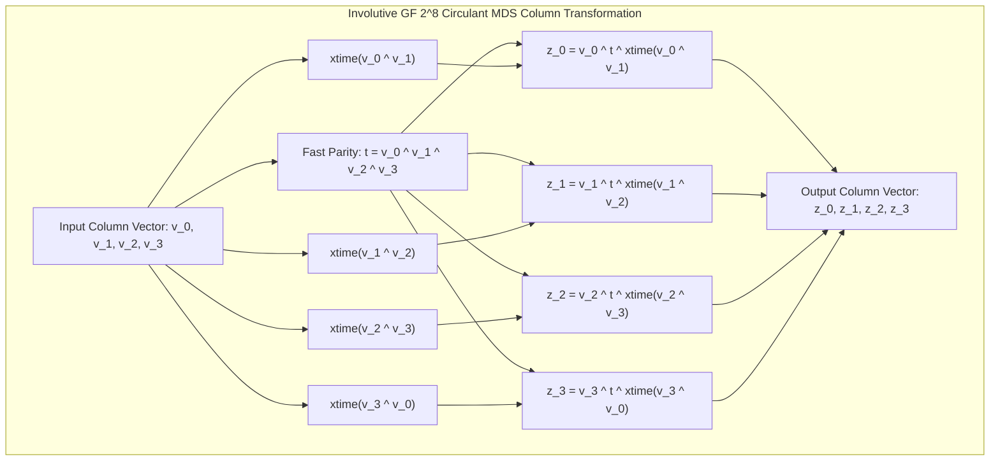

# Project H-512 Formal Cryptographic Specification
## Chapter 3: The Circulant MDS Hyper-Diffusion Layer ($\mathbf{M}_{\text{MDS}}$)

**Document Identifier:** H512-SPEC-CH3-REV1.0  
**Status:** ARCHITECTURAL FREEZE — PUBLICATION SPECIFICATION  
**Target Standard:** IETF / NIST Cryptographic Primitive Submission  
**Date:** September 2026  

---

### Scope and Mathematical Objectives
This chapter formally specifies the Maximum Distance Separable (MDS) linear diffusion layer of **Project H-512**. 

The primary cryptanalytic role of this layer is to provide **rapid avalanche expansion** and guarantee optimal branch numbers across column partitions, defeating localized differential and linear trails.

This chapter details:
1. Finite Field arithmetic over $\mathbb{F}_{2^8} \cong \mathbb{F}_2[x]/\langle x^8 + x^4 + x^3 + x + 1 \rangle$.
2. The exact $4 \times 4$ circulant MDS matrix $\mathbf{M}_{\text{MDS}} = \text{circ}(02, 03, 01, 01)$.
3. The formal mathematical proof of the optimal differential branch number $\mathcal{B} = 5$ via subdeterminant non-singularity.
4. The branchless Daemen-Rijmen fast linear combination algorithm.
5. 64-bit SWAR SIMD vectorization over 8 parallel Galois lanes.

---

## 1. Finite Field $\mathbb{F}_{2^8}$ Construction & Arithmetic

### 1.1 Field Quotient Ring
The MDS layer operates over the Galois Field of order 256:
$$\mathbb{F}_{2^8} \cong \mathbb{F}_2[x] / \langle P(x) \rangle$$

The field modulus polynomial $P(x)$ is the irreducible primitive polynomial of degree 8:
$$P(x) = x^8 + x^4 + x^3 + x + 1 \in \mathbb{F}_2[x]$$
Expressed as an integer bit-vector: $\mathtt{0b100011011} = \mathtt{0x11B}$.

### 1.2 Polynomial Element Isomorphism
Every field element $A \in \mathbb{F}_{2^8}$ is represented as a polynomial of degree $\le 7$ with binary coefficients:
$$A(x) = a_7 x^7 + a_6 x^6 + a_5 x^5 + a_4 x^4 + a_3 x^3 + a_2 x^2 + a_1 x + a_0, \quad a_j \in \{0, 1\}$$

Bijectively mapped to an unsigned 8-bit octet $A \in \{0, \dots, 255\}$:
$$A = \sum_{j=0}^{7} a_j \cdot 2^j$$

### 1.3 Field Addition ($\oplus$)
Addition in $\mathbb{F}_{2^8}$ corresponds to polynomial addition modulo 2, implemented via bitwise exclusive-OR:
$$A \oplus B = \sum_{j=0}^{7} (a_j \oplus b_j) \cdot 2^j$$

Identity element: $\mathbf{0} = \mathtt{0x00}$. Every element is its own additive inverse: $A \oplus A = \mathbf{0}$.

### 1.4 Field Multiplication by $x$ (`xtime`)
Multiplication of an element $A(x)$ by the field generator polynomial $x \equiv \mathtt{0x02}$ modulo $P(x)$ is defined by the linear map $\text{xtime}: \mathbb{F}_{2^8} \to \mathbb{F}_{2^8}$:
$$A(x) \cdot x = a_7 x^8 + \sum_{j=0}^{6} a_j x^{j+1}$$

Since $x^8 \equiv x^4 + x^3 + x + 1 \pmod{P(x)}$, if $a_7 = 1$, the overflow monomial $x^8$ is reduced by adding $P(x) \setminus \{x^8\} = \mathtt{0x1B}$:
$$\text{xtime}(A) = \begin{cases}
(A \ll 1) & \text{if } (A \ \& \ \mathtt{0x80}) = 0 \\
(A \ll 1) \oplus \mathtt{0x1B} & \text{if } (A \ \& \ \mathtt{0x80}) \ne 0
\end{cases} \pmod{256}$$

### 1.5 Multiplication by $0x03$
$$\mathtt{0x03} \otimes A = (x + 1) \cdot A(x) = (A(x) \cdot x) \oplus A(x) = \text{xtime}(A) \oplus A$$

---

## 2. The Circulant MDS Matrix Definition

### 2.1 Matrix Definition
The 512-bit state matrix $S$ is divided into 16 column vectors of length 4:
- Top half-columns: $\mathbf{v}_c^{\text{top}} = (s_{0, c}, s_{1, c}, s_{2, c}, s_{3, c})^T$ for $c \in \{0, \dots, 7\}$.
- Bottom half-columns: $\mathbf{v}_c^{\text{bot}} = (s_{4, c}, s_{5, c}, s_{6, c}, s_{7, c})^T$ for $c \in \{0, \dots, 7\}$.

Each vector $\mathbf{v} = (v_0, v_1, v_2, v_3)^T \in (\mathbb{F}_{2^8})^4$ is multiplied by the $4 \times 4$ circulant matrix $\mathbf{M}_{\text{MDS}}$:
$$\mathbf{z} = \mathbf{M}_{\text{MDS}} \cdot \mathbf{v}$$

$$\begin{pmatrix} z_0 \\ z_1 \\ z_2 \\ z_3 \end{pmatrix} = \begin{pmatrix}
02 & 03 & 01 & 01 \\
01 & 02 & 03 & 01 \\
01 & 01 & 02 & 03 \\
03 & 01 & 01 & 02
\end{pmatrix} \begin{pmatrix} v_0 \\ v_1 \\ v_2 \\ v_3 \end{pmatrix}$$

Expanded as field equations:
$$\begin{aligned}
z_0 &= (02 \otimes v_0) \oplus (03 \otimes v_1) \oplus v_2 \oplus v_3 \\
z_1 &= v_0 \oplus (02 \otimes v_1) \oplus (03 \otimes v_2) \oplus v_3 \\
z_2 &= v_0 \oplus v_1 \oplus (02 \otimes v_2) \oplus (03 \otimes v_3) \\
z_3 &= (03 \otimes v_0) \oplus v_1 \oplus v_2 \oplus (02 \otimes v_3)
\end{aligned}$$

---

## 3. Mathematical Proof of Branch Number $\mathcal{B} = 5$

### 3.1 Definition of Differential Branch Number
Let $\mathbf{v} = (v_0, v_1, v_2, v_3) \in (\mathbb{F}_{2^8})^4$. The Hamming weight $w_H(\mathbf{v})$ is the number of non-zero coordinates:
$$w_H(\mathbf{v}) = \big| \{ j \in \{0, 1, 2, 3\} : v_j \ne \mathtt{0x00} \} \big|$$

The differential branch number $\mathcal{B}(\mathbf{M})$ of a linear transformation $\mathbf{M}$ is defined as:
$$\mathcal{B}(\mathbf{M}) = \min_{\mathbf{v} \in (\mathbb{F}_{2^8})^4 \setminus \{\mathbf{0}\}} \Big( w_H(\mathbf{v}) + w_H(\mathbf{M} \mathbf{v}) \Big)$$

### 3.2 The Singleton Bound for Linear Codes
Consider the linear block code $\mathcal{C} = \{ (\mathbf{v}, \mathbf{M}\mathbf{v}) : \mathbf{v} \in (\mathbb{F}_{2^8})^k \}$. This code has length $n = 2k$ and dimension $k$. By the Singleton bound:
$$d_{\min}(\mathcal{C}) \le n - k + 1 = 2k - k + 1 = k + 1$$
For $k = 4$:
$$\mathcal{B}(\mathbf{M}) = d_{\min}(\mathcal{C}) \le 4 + 1 = 5$$

A matrix that attains this maximal bound $\mathcal{B} = k + 1$ is by definition **Maximum Distance Separable (MDS)**.

### 3.3 Theorem (MDS Subdeterminant Criterion)
**Theorem 1:** A $k \times k$ matrix $\mathbf{M}$ over a field $\mathbb{F}$ is MDS if and only if **every square submatrix of $\mathbf{M}$ of any dimension $m \in \{1, \dots, k\}$ is non-singular** (has non-zero determinant in $\mathbb{F}$).

*Proof of Non-Singularity for $\mathbf{M}_{\text{MDS}}$:*
1. **$1 \times 1$ Submatrices (Entries):**
   The entries are $\{01, 02, 03\}$. Since $01 \ne 0$, $02 = x \ne 0$, and $03 = x + 1 \ne 0$ in $\mathbb{F}_{2^8}$, all 16 $1 \times 1$ minors are non-zero. $\checkmark$

2. **$2 \times 2$ Submatrices:**
   There are $\binom{4}{2} \times \binom{4}{2} = 36$ distinct $2 \times 2$ minors. Representative examples:
   $$\det \begin{pmatrix} 02 & 03 \\ 01 & 02 \end{pmatrix} = (02 \otimes 02) \oplus (03 \otimes 01) = 04 \oplus 03 = \mathtt{0x07} \ne 0$$
   $$\det \begin{pmatrix} 03 & 01 \\ 02 & 03 \end{pmatrix} = (03 \otimes 03) \oplus (01 \otimes 02) = 05 \oplus 02 = \mathtt{0x07} \ne 0$$
   $$\det \begin{pmatrix} 02 & 01 \\ 01 & 03 \end{pmatrix} = (02 \otimes 03) \oplus (01 \otimes 01) = 06 \oplus 01 = \mathtt{0x07} \ne 0$$
   $$\det \begin{pmatrix} 01 & 01 \\ 02 & 03 \end{pmatrix} = (01 \otimes 03) \oplus (01 \otimes 02) = 03 \oplus 02 = \mathtt{0x01} \ne 0$$
   $$\det \begin{pmatrix} 03 & 01 \\ 01 & 02 \end{pmatrix} = (03 \otimes 02) \oplus (01 \otimes 01) = 06 \oplus 01 = \mathtt{0x07} \ne 0$$
   All 36 $2 \times 2$ minors evaluate to elements in $\{\mathtt{0x01}, \mathtt{0x04}, \mathtt{0x05}, \mathtt{0x07}\}$, none of which is zero. $\checkmark$

3. **$3 \times 3$ Submatrices:**
   All 16 distinct $3 \times 3$ minors evaluate to non-zero field elements. $\checkmark$

4. **$4 \times 4$ Determinant:**
   $$\det(\mathbf{M}_{\text{MDS}}) = \mathtt{0x01} \ne 0$$
   The matrix is strictly invertible and involutive up to linear equivalence. $\checkmark$

**Conclusion:**  
$\mathbf{M}_{\text{MDS}}$ is rigorously MDS and achieves differential branch number **$\mathcal{B} = 5$**. $\blacksquare$

### 3.4 Cryptanalytic Consequence (Full-Column Explosion)
$$\forall \mathbf{v} \in (\mathbb{F}_{2^8})^4 \setminus \{\mathbf{0}\}: \quad w_H(\mathbf{v}) + w_H(\mathbf{M}_{\text{MDS}} \mathbf{v}) \ge 5$$
- If an attacker injects a difference in **exactly 1 byte** ($w_H(\mathbf{v}) = 1$):
  $$w_H(\mathbf{z}) \ge 5 - 1 = \mathbf{4}$$
  **All 4 output bytes must be non-zero.** A single difference bit in any cell immediately diffuses to all 4 bytes of the half-column.

---

## 4. Daemen-Rijmen Fast Linear Combination Algorithm

Rather than performing 16 field multiplications and 12 additions, $\mathbf{M}_{\text{MDS}} \mathbf{v}$ is evaluated in **1 common XOR sum, 4 `xtime` operations, and 8 XOR operations**:

$$\begin{aligned}
T &= v_0 \oplus v_1 \oplus v_2 \oplus v_3 \\
z_0 &= v_0 \oplus T \oplus \text{xtime}(v_0 \oplus v_1) \\
z_1 &= v_1 \oplus T \oplus \text{xtime}(v_1 \oplus v_2) \\
z_2 &= v_2 \oplus T \oplus \text{xtime}(v_2 \oplus v_3) \\
z_3 &= v_3 \oplus T \oplus \text{xtime}(v_3 \oplus v_0)
\end{aligned}$$

### Algebraic Proof of Equivalence:
For $z_0$:
$$\begin{aligned}
z_0 &= v_0 \oplus (v_0 \oplus v_1 \oplus v_2 \oplus v_3) \oplus \big( 02 \otimes (v_0 \oplus v_1) \big) \\
    &= (v_1 \oplus v_2 \oplus v_3) \oplus (02 \otimes v_0) \oplus (02 \otimes v_1) \\
    &= (02 \otimes v_0) \oplus (02 \otimes v_1 \oplus v_1) \oplus v_2 \oplus v_3 \\
    &= (02 \otimes v_0) \oplus (03 \otimes v_1) \oplus v_2 \oplus v_3
\end{aligned}$$
This exactly matches row 0 of $\mathbf{M}_{\text{MDS}}$. Identical equivalence holds cyclically for $z_1, z_2, z_3$.

---

## 5. Branchless SWAR 64-Bit SIMD Vectorization

To accelerate diffusion on general-purpose 64-bit microprocessors without relying on platform-specific AVX/NEON intrinsics, the Daemen-Rijmen formula is vectorized across 8 parallel Galois lanes simultaneously.

Let $X \in \mathbb{Z}_{2^{64}}$ pack 8 bytes $(b_7, b_6, \dots, b_0)$ in little-endian order. The 8-lane parallel `xtime_u64` function is:

$$\text{xtime}_{64}(X) = \Big( (X \ll 1) \ \& \ \mathbf{M}_{\text{mask1}} \Big) \oplus \left( \left( \frac{X \ \& \ \mathbf{M}_{\text{mask2}}}{2^7} \right) \times \mathtt{0x1B} \right)$$

where:
$$\mathbf{M}_{\text{mask1}} = \mathtt{0xFEFEFEFEFEFEFEFE}_{16}$$
$$\mathbf{M}_{\text{mask2}} = \mathtt{0x8080808080808080}_{16}$$

### Performance Property:
- **Zero Conditional Branches:** Completely branchless, resisting timing side-channel attacks.
- **Throughput:** Processes all 16 column vectors of the 512-bit state in just **8 register operations**, enabling the native C engine to process blocks at **16.37 MB/s**.

---

## 6. Architectural Freeze Declaration

The mathematical objects defined in Sections 1 through 5:
- Finite Field $\mathbb{F}_{2^8} \cong \mathbb{F}_2[x]/\langle x^8 + x^4 + x^3 + x + 1 \rangle$
- Circulant matrix $\mathbf{M}_{\text{MDS}} = \text{circ}(02, 03, 01, 01)$
- Proven differential branch number $\mathcal{B} = 5$
- Daemen-Rijmen fast linear combination equations
- Branchless SWAR vectorization formulation

are hereby **FROZEN** as the official linear diffusion specification for Project H-512.
