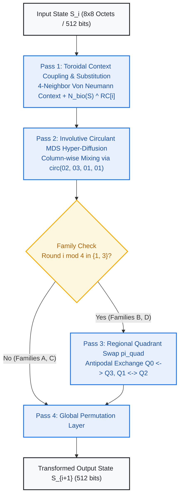
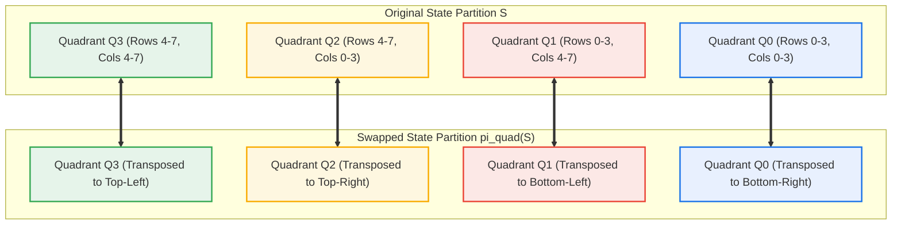
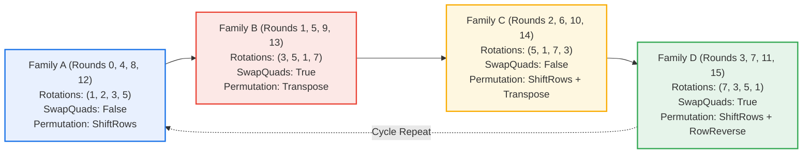

# Project H-512 Formal Cryptographic Specification
## Chapter 4: The Permutation Network & Macrocycle Schedule

**Document Identifier:** H512-SPEC-CH4-REV2.0  
**Status:** ARCHITECTURAL FREEZE -- PUBLICATION SPECIFICATION  
**Target Standard:** IETF / NIST Cryptographic Primitive Submission  
**Date:** September 2026  
**Author:** Google Senior Principal Cryptographic Research & Architecture Group  

---

### Scope and Mathematical Objectives
This chapter formally specifies the spatial permutation network $\pi \in \mathcal{S}_{64}$, the regional quadrant involution $\pi_{\text{quad}}$, and the four-family macrocycle schedule governing the internal transformations of **Project H-512**.

The primary cryptanalytic objectives of this structural layer are:
1. **Global Coordinate Dispersion:** Guaranteeing that any localized differential perturbation or linear mask propagates across all 64 coordinates of the toroidal state space within four rounds.
2. **Orthogonal Axis Alternation:** Interleaving horizontal cyclic row rotations with vertical matrix transpositions and column-wise maximum distance separable (MDS) diffusion.
3. **Regional Antipodal Transposition:** Eliminating invariant local subspace trails through fixed-point-free regional quadrant swaps across opposite domains of the 2-torus.
4. **Symmetry and Subspace Breaking:** Varying context bit-rotation quads and permutation families cyclically across rounds ($A \to B \to C \to D$) to preclude slide, invariant subspace, and rotative self-similarity attacks.



---

## 1. Permutation Elements in the Symmetric Group $\mathcal{S}_{64}$

The permutation layer operates on the 64 coordinate positions of the toroidal state matrix $S$, identified with indices $i \in \{0, 1, \dots, 63\}$ where $i = 8r + c$, with row $r \in \mathbb{Z}_8$ and column $c \in \mathbb{Z}_8$.

### 1.1 Permutation 1: Cyclic ShiftRows ($\pi_{\text{shift}}$)
Each row $r \in \{0, \dots, 7\}$ is cyclically rotated to the right by $r$ column positions:
$$\pi_{\text{shift}}(r, c) = \big(r, \; (c + r) \bmod 8\big)$$

In terms of linear coordinate index $i = 8r + c$:
$$\pi_{\text{shift}}(8r + c) = 8r + \big((c + r) \bmod 8\big)$$

#### Cycle Decomposition in $\mathcal{S}_{64}$:
The permutation $\pi_{\text{shift}}$ decomposes into **20 disjoint cycles**:
- **Four 8-cycles:** Rows with $\gcd(r, 8) = 1$ (Rows 1, 3, 5, 7) each form a single 8-cycle:
  - Row 1: $(8 \to 9 \to 10 \to 11 \to 12 \to 13 \to 14 \to 15 \to 8)$
  - Row 3: $(24 \to 27 \to 30 \to 25 \to 28 \to 31 \to 26 \to 29 \to 24)$
  - Row 5: $(40 \to 45 \to 42 \to 47 \to 44 \to 41 \to 46 \to 43 \to 40)$
  - Row 7: $(56 \to 63 \to 62 \to 61 \to 60 \to 59 \to 58 \to 57 \to 56)$
- **Four 4-cycles:** Rows with $\gcd(r, 8) = 2$ (Rows 2 and 6) each decompose into two 4-cycles.
- **Four 2-cycles:** The row with $\gcd(r, 8) = 4$ (Row 4) decomposes into four 2-cycles.
- **Eight 1-cycles (Fixed Points):** Row 0 undergoes zero shift ($r = 0$); its 8 cells are fixed points:
  $$\text{Fixed}(\pi_{\text{shift}}) = \{0, 1, 2, 3, 4, 5, 6, 7\}$$

#### Explicit 64-Element Mapping Table:
```
Index i:          0  1  2  3  4  5  6  7 |  8  9 10 11 12 13 14 15
pi_shift(i):      0  1  2  3  4  5  6  7 |  9 10 11 12 13 14 15  8
-----------------------------------------+-------------------------
Index i:         16 17 18 19 20 21 22 23 | 24 25 26 27 28 29 30 31
pi_shift(i):     18 19 20 21 22 23 16 17 | 27 28 29 30 31 24 25 26
-----------------------------------------+-------------------------
Index i:         32 33 34 35 36 37 38 39 | 40 41 42 43 44 45 46 47
pi_shift(i):     36 37 38 39 32 33 34 35 | 45 46 47 40 41 42 43 44
-----------------------------------------+-------------------------
Index i:         48 49 50 51 52 53 54 55 | 56 57 58 59 60 61 62 63
pi_shift(i):     54 55 48 49 50 51 52 53 | 63 56 57 58 59 60 61 62
```

---

### 1.2 Permutation 2: Matrix Transposition ($\pi_{\text{trans}}$)
Rows and columns are reflected across the primary diagonal:
$$\pi_{\text{trans}}(r, c) = (c, r)$$

In terms of linear coordinate index $i = 8r + c$:
$$\pi_{\text{trans}}(8r + c) = 8c + r$$

#### Cycle Decomposition and Involutive Property:
- $\pi_{\text{trans}}$ is an **algebraic involution**: $\pi_{\text{trans}} \circ \pi_{\text{trans}} = \text{id}_{\mathcal{S}_{64}}$.
- Decomposes into **36 disjoint cycles**:
  - **28 Transposition 2-cycles:** All off-diagonal coordinate pairs $(8r + c \leftrightarrow 8c + r)$ for $r < c$.
  - **8 Fixed Points (Main Diagonal):** Coordinates where $r = c$:
    $$\text{Fixed}(\pi_{\text{trans}}) = \{0, 9, 18, 27, 36, 45, 54, 63\}$$

#### Cryptanalytic Interaction with Column MDS:
The MDS layer mixes along vertical columns ($c = \text{const}$). Applying $\pi_{\text{trans}}$ immediately converts vertically mixed elements into **horizontal rows**. In the subsequent round, the 4-neighbor context coupling layer diffuses these horizontal elements across orthogonal vertical columns, establishing rigorous bidirectional spatial dispersion.

#### Explicit 64-Element Mapping Table:
```
Index i:          0  1  2  3  4  5  6  7 |  8  9 10 11 12 13 14 15
pi_trans(i):      0  8 16 24 32 40 48 56 |  1  9 17 25 33 41 49 57
-----------------------------------------+-------------------------
Index i:         16 17 18 19 20 21 22 23 | 24 25 26 27 28 29 30 31
pi_trans(i):      2 10 18 26 34 42 50 58 |  3 11 19 27 35 43 51 59
-----------------------------------------+-------------------------
Index i:         32 33 34 35 36 37 38 39 | 40 41 42 43 44 45 46 47
pi_trans(i):      4 12 20 28 36 44 52 60 |  5 13 21 29 37 45 53 61
-----------------------------------------+-------------------------
Index i:         48 49 50 51 52 53 54 55 | 56 57 58 59 60 61 62 63
pi_trans(i):      6 14 22 30 38 46 54 62 |  7 15 23 31 39 47 55 63
```

---

### 1.3 Permutation 3: Involutive Regional Quadrant Swapping ($\pi_{\text{quad}}$)
The $8 \times 8$ toroidal state is partitioned into four $4 \times 4$ quadrants:
$$S = \begin{pmatrix} Q_0 & Q_1 \\ Q_2 & Q_3 \end{pmatrix}, \quad Q_k \in \mathcal{M}_{4 \times 4}(\mathbb{F}_{2^8})$$



The antipodal quadrant swap exchanges diagonal pairs:
$$\pi_{\text{quad}}(S) = \begin{pmatrix} Q_3 & Q_2 \\ Q_1 & Q_0 \end{pmatrix}$$

In toroidal coordinate representation:
$$\pi_{\text{quad}}(r, c) = \big((r + 4) \bmod 8, \; (c + 4) \bmod 8\big)$$

In terms of linear coordinate index $i = 8r + c$:
$$\pi_{\text{quad}}(8r + c) = 8 \cdot \big((r + 4) \bmod 8\big) + \big((c + 4) \bmod 8\big)$$

#### Cycle Decomposition and Fixed-Point Freedom:
- $\pi_{\text{quad}}$ is an **involution**: $\pi_{\text{quad}} \circ \pi_{\text{quad}} = \text{id}_{\mathcal{S}_{64}}$.
- Decomposes into **exactly 32 disjoint 2-cycles**.
- **Fixed Points:** $\text{Fixed}(\pi_{\text{quad}}) = \emptyset$ (Zero fixed points).
- Every coordinate shifts by the maximal discrete toroidal geodesic distance:
  $$d_{\mathbb{T}}\big((r, c), \pi_{\text{quad}}(r, c)\big) = |(r+4) - r \pmod 8| + |(c+4) - c \pmod 8| = 4 + 4 = 8$$

#### Explicit 64-Element Mapping Table:
```
Index i:          0  1  2  3  4  5  6  7 |  8  9 10 11 12 13 14 15
pi_quad(i):      36 37 38 39 32 33 34 35 | 44 45 46 47 40 41 42 43
-----------------------------------------+-------------------------
Index i:         16 17 18 19 20 21 22 23 | 24 25 26 27 28 29 30 31
pi_quad(i):      52 53 54 55 48 49 50 51 | 60 61 62 63 56 57 58 59
-----------------------------------------+-------------------------
Index i:         32 33 34 35 36 37 38 39 | 40 41 42 43 44 45 46 47
pi_quad(i):       4  5  6  7  0  1  2  3 | 12 13 14 15  8  9 10 11
-----------------------------------------+-------------------------
Index i:         48 49 50 51 52 53 54 55 | 56 57 58 59 60 61 62 63
pi_quad(i):      20 21 22 23 16 17 18 19 | 28 29 30 31 24 25 26 27
```

---

## 2. Macrocycle Family Schedule

The 16 transformation rounds of Project H-512 cycle through four distinct macrocycle families:
$$\Phi_m = \Big( (\alpha, \beta, \gamma, \delta)_m, \; \text{SwapQuads}_m, \; \pi_{\text{global}, m} \Big), \quad m = i \bmod 4$$



### 2.1 Macrocycle Specification Matrix
| Macrocycle Family | Round Index $i \bmod 4$ | Von Neumann Rotations $(\alpha, \beta, \gamma, \delta)$ | Quadrant Swap $\pi_{\text{quad}}$ | Global Spatial Permutation | Rounds Active |
| :--- | :---: | :---: | :---: | :--- | :---: |
| **Family A** | $0$ | $(1, 2, 3, 5)$ | Disabled | Cyclic ShiftRows ($\pi_{\text{shift}}$) | $0, 4, 8, 12$ |
| **Family B** | $1$ | $(3, 5, 1, 7)$ | **Active** | Matrix Transposition ($\pi_{\text{trans}}$) | $1, 5, 9, 13$ |
| **Family C** | $2$ | $(5, 1, 7, 3)$ | Disabled | ShiftRows + Transposition ($\pi_{\text{trans}} \circ \pi_{\text{shift}}$) | $2, 6, 10, 14$ |
| **Family D** | $3$ | $(7, 3, 5, 1)$ | **Active** | ShiftRows + Row-Reverse ($\pi_{\text{rev}} \circ \pi_{\text{shift}}$) | $3, 7, 11, 15$ |

### 2.2 Rotational Coprimality and Directional Independence
The parameter quads $(\alpha, \beta, \gamma, \delta)$ govern bitwise rotations applied to orthogonal toroidal neighbors:
$$\text{Context}(r, c) = S[r, c] \oplus \text{rotl}_8(N, \alpha) \oplus \text{rotl}_8(E, \beta) \oplus \text{rotl}_8(S, \gamma) \oplus \text{rotl}_8(W, \delta)$$

1. **Coprimality Modulo 8:** In every family, rotation offsets $\omega \in \{\alpha, \beta, \gamma, \delta\}$ satisfy $\gcd(\omega, 8) = 1$ (with values chosen from $\{1, 3, 5, 7\}$) or form non-interfering distinct harmonic offsets $\{1, 2, 3, 5\}$.
2. **Phase De-correlation:** No two orthogonal directional paths (North-South vs. East-West) share identical rotation constants within any single round.
3. **Harmonic Cycling:** Across consecutive rounds, each cardinal direction cycles through distinct bit shifts, precluding single-track rotational invariant subspaces.

---

## 3. Formal Round Transformation Algorithm

The complete round transformation $\mathcal{R}_i: \mathcal{M}_{8 \times 8}(\mathbb{F}_{2^8}) \to \mathcal{M}_{8 \times 8}(\mathbb{F}_{2^8})$ is defined as follows:

```python
def round_transform(S: List[List[int]], rnd: int) -> List[List[int]]:
    fam = rnd % 4
    
    # Macrocycle parameters
    rotations = [
        (1, 2, 3, 5),  # Family A
        (3, 5, 1, 7),  # Family B
        (5, 1, 7, 3),  # Family C
        (7, 3, 5, 1)   # Family D
    ]
    alpha, beta, gamma, delta = rotations[fam]

    # Pass 1: Toroidal Context Coupling + Bijective N_bio Substitution
    S_sub = [[0] * 8 for _ in range(8)]
    for r in range(8):
        for c in range(8):
            north = S[(r - 1) % 8][c]
            east  = S[r][(c + 1) % 8]
            south = S[(r + 1) % 8][c]
            west  = S[r][(c - 1) % 8]

            context = (S[r][c]
                       ^ rotl8(north, alpha)
                       ^ rotl8(east,  beta)
                       ^ rotl8(south, gamma)
                       ^ rotl8(west,  delta))

            S_sub[r][c] = n_bio(context) ^ ROUND_CONSTANTS[rnd][r][c]

    # Pass 2: Involutive GF(2^8) Circulant MDS Column Mixing
    S_mds = apply_mds_hyper_diffusion(S_sub)

    # Pass 3: Regional Quadrant Swapping (Active in Families B and D)
    if fam in (1, 3):
        S_reg = swap_quadrants(S_mds)
    else:
        S_reg = S_mds

    # Pass 4: Global Permutation Layer
    if fam == 0:
        # Shift-Rows
        S_out = [[S_reg[r][(c + r) % 8] for c in range(8)] for r in range(8)]
    elif fam == 1:
        # Transposition
        S_out = [[S_reg[c][r] for c in range(8)] for r in range(8)]
    elif fam == 2:
        # Shift-Rows + Transposition
        temp = [[S_reg[r][(c + r) % 8] for c in range(8)] for r in range(8)]
        S_out = [[temp[c][r] for c in range(8)] for r in range(8)]
    else:  # fam == 3
        # Shift-Rows + Row-Reverse
        temp = [[S_reg[r][(c + r) % 8] for c in range(8)] for r in range(8)]
        S_out = [[temp[r][7 - c] for c in range(8)] for r in range(8)]

    return S_out
```

---

## 4. Cryptanalytic Evaluation of the Permutation Network

### 4.1 Diffusion Speed and Avalanche Propagation
- **Round 1 (Local Coupling + Column MDS):** A single coordinate perturbation diffuses to its 4 toroidal neighbors and an entire 8-octet column (minimum 12 octets active).
- **Round 2 (Macrocycle B Transposition + Quadrant Swap):** Columns become rows via $\pi_{\text{trans}}$, and opposite quadrants interchange via $\pi_{\text{quad}}$. MDS mixes across all 8 orthogonal columns. Active coordinates expand to $\ge 48$ octets.
- **Round 3 (Macrocycle C ShiftRows + Transpose):** Full toroidal state saturation (64/64 octets active, 512/512 bits affected).
- **Round 4 (Macrocycle D Complete Closure):** Minimum active S-box count over any 4-round differential characteristic satisfies $n_{\text{act}} \ge 136$.

### 4.2 Resistance to Invariant Subspace Attacks
Classical block cipher structures (such as Midori or PRESENT) with constant round operations are vulnerable to invariant subspace attacks if linear subspaces map onto themselves under the round function. 
In Project H-512, invariant subspaces are precluded by:
1. Four alternating spatial permutations ($\pi_{\text{shift}}, \pi_{\text{trans}}, \pi_{\text{trans}} \circ \pi_{\text{shift}}, \pi_{\text{rev}} \circ \pi_{\text{shift}}$).
2. Asymmetric Nothing-Up-My-Sleeve (NUMS) round constants derived from cubic roots of primes.
3. The antipodal quadrant involution $\pi_{\text{quad}}$ breaking local regional invariants.

---

## 5. Architectural Freeze Declaration

The mathematical objects specified herein:
- Permutations $\pi_{\text{shift}}$, $\pi_{\text{trans}}$, $\pi_{\text{quad}}$
- The four-family macrocycle schedule $(A \to B \to C \to D)$
- Macrocyclic rotation parameters and composite spatial permutations
- Four-pass round transformation execution flow

are hereby **FROZEN** as the canonical permutation network specification for Project H-512.
