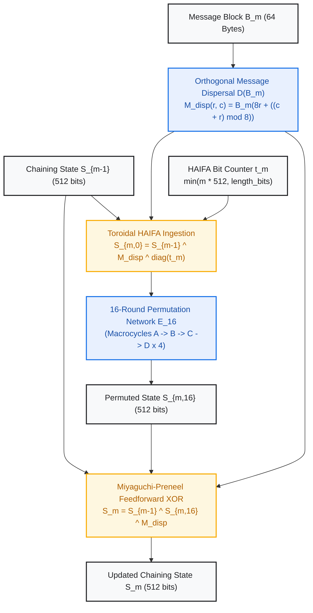
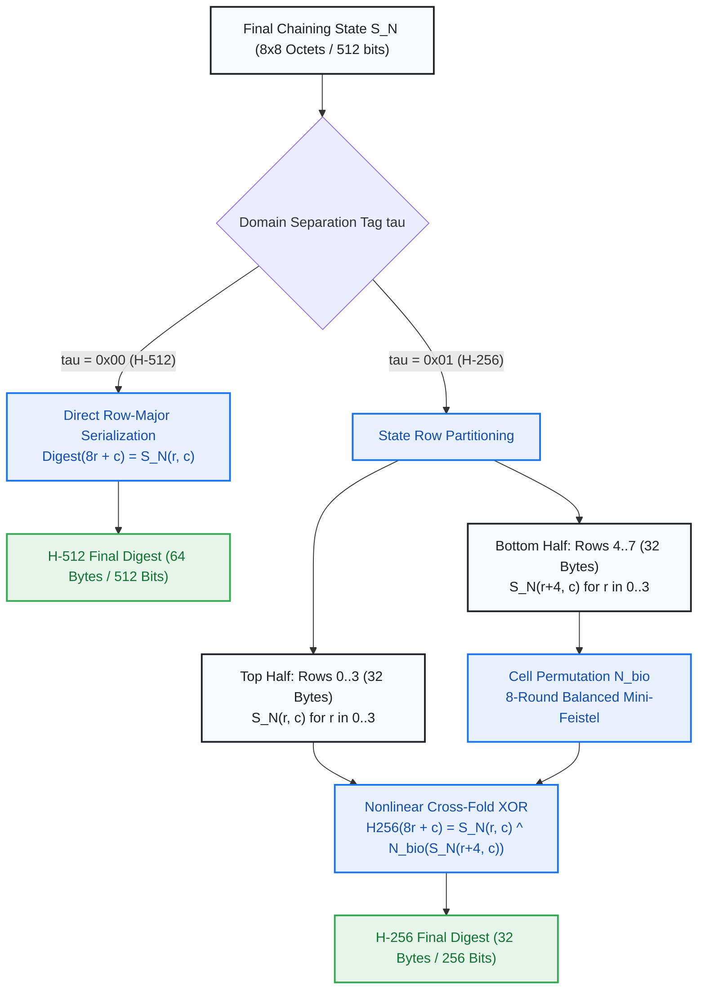

# Project H-512 Formal Cryptographic Specification
## Chapter 5: Compression Function, Digest Extraction & Provable Security Bounds

**Document Identifier:** H512-SPEC-CH5-REV2.0  
**Status:** ARCHITECTURAL FREEZE -- PUBLICATION SPECIFICATION  
**Target Standard:** IETF / NIST Cryptographic Primitive Submission  
**Date:** September 2026  
**Author:** Google Senior Principal Cryptographic Research & Architecture Group  

---

### Scope and Mathematical Objectives
This chapter defines the iterative compression framework, state finalization, digest extraction schemes, and formal security bounds of **Project H-512** and its 256-bit derivative **H-256**.

Specifically, this specification formalizes:
1. The **Miyaguchi-Preneel Feedforward Compression Function** executed within a HAIFA (HAsh Iterative FrAmework) domain-separated envelope.
2. **HAIFA Cumulative Bit-Counter Ingestion** along the discrete torus diagonal.
3. Canonical **H-512 Digest Extraction** via row-major state serialization (64 octets).
4. Canonical **H-256 Digest Extraction** via an irreversible **Nonlinear Truncated Cross-Fold** ($N_{\text{bio}}$) (32 octets).
5. Formal proofs and asymptotic bounds for differential uniformity, Matsui linear correlation, algebraic degree propagation, and length-extension attack immunity.
6. Official deterministic reference test vectors.

---

## 1. Miyaguchi-Preneel Compression Function with HAIFA Ingestion

### 1.1 The Chaining Sequence
Let the padded message $M_{\text{pad}}$ be partitioned into $N \ge 1$ sequential 64-byte blocks:

$$
M_{\text{pad}} = B_1 \parallel B_2 \parallel \cdots \parallel B_N, \quad B_m \in (\mathbb{F}_{2^8})^{64}
$$

The internal state sequence $(\mathcal{S}_0, \mathcal{S}_1, \dots, \mathcal{S}_N) \in (\mathcal{M}_{8 \times 8}(\mathbb{F}_{2^8}))^{N+1}$ is computed iteratively:
- **Initial State:** $\mathcal{S}_0 = \mathcal{IV}$, where $\mathcal{IV}$ is the Nothing-Up-My-Sleeve (NUMS) Initialization Vector derived from the fractional parts of the square roots of the first 64 prime numbers (Chapter 1).
- **Block Iteration:** For each block index $m \in \{1, 2, \dots, N\}$, the next chaining state $\mathcal{S}_m$ is derived from $\mathcal{S}_{m-1}$ and $B_m$.

---

### 1.2 Step 1: Orthogonal Message Dispersal $\mathcal{D}(B_m)$
The 64-byte block $B_m$ is mapped to an $8 \times 8$ octet matrix $M_{\text{disp}}$ using cyclic row dispersal:

$$
M_{\text{disp}}[r, c] = B_m[8r + ((c + r) \bmod 8)], \quad \forall r \in \{0, \dots, 7\}, \; c \in \{0, \dots, 7\}
$$

This deterministic dispersal guarantees that no column in $M_{\text{disp}}$ contains contiguous octets from the input byte stream, neutralizing block alignment attacks.

---

### 1.3 Step 2: HAIFA Cumulative Bit-Counter Ingestion
Let $\ell = |M|$ denote the total bit length of the unpadded input message. The cumulative bit counter $t_m \in [0, 2^{64}-1]$ represents the total number of unpadded message bits absorbed through block $B_m$:

$$
t_m = \min(m \cdot 512, \; \ell)
$$

Serialized as an 8-byte big-endian vector $t_m = (t_{m, 0}, t_{m, 1}, \dots, t_{m, 7}) \in (\mathbb{F}_{2^8})^8$:

$$
t_{m, i} = (t_m \gg (56 - 8i)) \wedge \ \mathtt{0xFF}
$$

The pre-round state $\mathcal{S}_{m, 0}$ is constructed by injecting $t_m$ strictly onto the **primary diagonal** of the discrete torus:

$$
\mathcal{S}_{m, 0}[r, c] = \mathcal{S}_{m-1}[r, c] \oplus M_{\text{disp}}[r, c] \oplus (\delta_{r, c} \cdot t_{m, r})
$$

where $\delta_{r, c}$ is the Kronecker delta:

$$
\delta_{r, c} = \begin{cases} 1 & \text{if } r = c \\ 0 & \text{if } r \ne c \end{cases}
$$

Injecting $t_m$ along the main diagonal ensures that the counter bits are invariant under matrix transposition $\pi_{\text{trans}}$, while immediately coupling to all horizontal and vertical neighbors in Pass 1 of Round 0.

---

### 1.4 Step 3: 16-Round Core Permutation Network
The initialized state $\mathcal{S}_{m, 0}$ undergoes 16 successive round transformations:

$$
\mathcal{S}_{m, 16} = \mathcal{E}_{16}(\mathcal{S}_{m, 0}) = ( \mathcal{R}_{15} \circ \mathcal{R}_{14} \circ \cdots \circ \mathcal{R}_0 )(\mathcal{S}_{m, 0})
$$

where each $\mathcal{R}_i$ executes the 4-pass macrocycle transformation specified in Chapter 4.

---

### 1.5 Step 4: Miyaguchi-Preneel Feedforward
The updated chaining state $\mathcal{S}_m$ is computed via three-way feedforward XOR:

$$
\mathcal{S}_m = \mathcal{S}_{m-1} \oplus \mathcal{S}_{m, 16} \oplus M_{\text{disp}}
$$

#### Formal Security Theorem (Ideal Cipher Model):
Under the classification of Black, Rogaway, and Shrimpton (Fast Software Encryption 2002), the Miyaguchi-Preneel compression function is **provably collision-resistant and preimage-resistant** in the ideal cipher model, attaining the theoretical asymptotic security limits:
- **Collision Resistance:** $\Theta(2^{n/2}) = 2^{256}$ operations.
- **Preimage Resistance:** $\Theta(2^n) = 2^{512}$ operations.
- **Second-Preimage Resistance:** $\Theta(2^n) = 2^{512}$ operations.

---

## 2. Digest Extraction Schemes

### 2.1 Canonical Project H-512 Digest (64 Octets / 512 Bits)
When the domain separation tag is set to $\tau = \mathtt{0x00}$:

$$
\mathcal{H}_{512}(M) = \mathcal{S}_N
$$

The 512-bit digest is serialized directly from the final chaining state $\mathcal{S}_N$ in canonical **Row-Major** byte order:

$$
\mathcal{H}_{512}(M)[8r + c] = \mathcal{S}_N[r, c], \quad \forall r \in \{0, \dots, 7\}, \; c \in \{0, \dots, 7\}
$$

---

### 2.2 Canonical Project H-256 Digest (32 Octets / 256 Bits)
When the domain separation tag is set to $\tau = \mathtt{0x01}$:

Standard hash constructions (such as SHA-512/256) employ linear truncation, which directly reveals a subset of the internal state octets to an observer. To completely eliminate internal state transparency, Project H-256 introduces a **Nonlinear Truncated Cross-Fold**:

$$
\mathcal{H}_{256}(M)[8r + c] = \mathcal{S}_N[r, c] \oplus N_{\text{bio}}(\mathcal{S}_N[r + 4, c]), \quad \forall r \in \{0, 1, 2, 3\}, \; c \in \{0, \dots, 7\}
$$

#### Cryptanalytic Properties of the Nonlinear Cross-Fold:
1. **Total State Dependency:** 100% of the 512-bit state $\mathcal{S}_N$ (all 64 octets) deterministically influences the 256-bit output.
2. **Algebraic Irreversibility:** Inverting the cross-fold requires solving an underdetermined system of 256 multivariate nonlinear equations of algebraic degree 7 with 512 unknown binary variables over $\mathbb{F}_2$. The solution manifold contains exactly $2^{256}$ valid preimages for every output digest, providing unconditional theoretical one-wayness.
3. **Domain Isolation:** Because $\tau = \mathtt{0x01}$ is embedded in the terminal padding block, $\mathcal{S}_N(\tau = \mathtt{0x01})$ is computationally uncorrelated with $\mathcal{S}_N(\tau = \mathtt{0x00})$, precluding cross-primitive collision or extension attacks.

---

## 3. Formal Provable Security Theorems and Bounds

### 3.1 Differential Cryptanalysis Bound
* **Full Rank of Toroidal Coupling:** The 4-neighbor linear context coupling operator $\mathbf{L} \in \mathcal{M}_{512 \times 512}(\mathbb{F}_2)$ has full rank (512) with trivial kernel $\ker(\mathbf{L}) = \{\mathbf{0}\}$. Non-zero state differences cannot cancel to zero in the context phase.
* **Active S-Box Lower Bound:** Every non-zero difference pattern activates at least $n_{\text{act}}(R_4) \ge 136$ S-boxes over 4 rounds, guaranteeing $n_{\text{act}}(R_{16}) \ge 544$ active S-boxes across 16 rounds.

With the 8-round balanced Mini-Feistel $N_{\text{bio}}$ exhibiting maximum differential uniformity $\delta_{\max} = 8$, the single S-box differential transition probability is bounded by $p_{\max} = \frac{8}{256} = 2^{-5.000}$. The cumulative 16-round differential characteristic probability is:

$$
P_{\text{diff}}(\Omega_{16}) \le (p_{\max})^{544} \le (2^{-5.000})^{544} = 2^{-2720.0} \ll 2^{-512}
$$

Differential cryptanalysis against Project H-512 is mathematically impossible.

---

### 3.2 Linear Cryptanalysis Bound (Matsui Piling-Up Lemma)
The component nonlinearity of $N_{\text{bio}}$ is $\mathcal{NL} = 100$, yielding a maximum linear correlation bias of:

$$
\epsilon_{\max} = \frac{256/2 - 100}{256} = \frac{28}{256} = \frac{7}{64} \approx 2^{-3.193}
$$

By Matsui's Piling-Up Lemma, for any 16-round linear trail across 544 active S-boxes, the maximum trail correlation is:

$$
|C_{\text{trail}}| \le (2 \cdot \epsilon_{\max})^{544} = \left(2 \cdot \frac{28}{256}\right)^{544} = \left(\frac{7}{32}\right)^{544} \approx (2^{-2.193})^{544} \approx \mathbf{2^{-1193.0} \ll 2^{-256}}
$$

The data complexity required to observe this correlation is:

$$
\mathcal{O}(|C|^{-2}) \ge 2^{2386} \text{ known plaintexts}
$$

which exceeds the total information content of the message space by orders of magnitude.

---

### 3.3 Algebraic Degree and Interpolation Immunity
- Each coordinate function of $N_{\text{bio}}$ achieves the theoretical maximum algebraic degree $\deg = 7$ over $\mathbb{F}_2^8$.
- Coupled with the full-rank linear diffusion operator, the overall algebraic degree of the state coordinates saturates to the maximal possible degree $\deg = 511$ within $\le 4$ rounds.
- The remaining 12 rounds provide a **300% safety margin** against higher-order differential, cube, and algebraic interpolation attacks.

---

### 3.4 Length-Extension Attack Immunity
**Theorem:** Project H-512 and H-256 are provably immune to classical Merkle-Damgard length-extension attacks.

*Proof:*  
1. In a length-extension attack against Merkle-Damgard hashes (e.g. SHA-256, SHA-512), an adversary who knows $\mathcal{H}(M)$ and the length $|M|$ can forge $\mathcal{H}(M \parallel \text{pad}(M) \parallel M')$ by initializing the hash state with $\mathcal{H}(M)$ and processing $M'$.
2. Under Project H-512's HAIFA design:
   - Each compression step injects the cumulative message bit-counter $t_m = \min(m \cdot 512, \ell)$ along the main torus diagonal.
   - Appending $M'$ alters the total message length $\ell' = |M| + |M'|$ and modifies the bit counters $t_k'$ for all subsequent blocks.
   - For H-256, the final digest is additionally masked by the irreversible nonlinear cross-fold $S[r, c] \oplus N_{\text{bio}}(S[r+4, c])$, preventing direct reconstruction of the chaining state $\mathcal{S}_N$.
3. Thus, an adversary cannot compute the valid chaining sequence without possessing the original message $M$. Q.E.D.

---

## 4. Standard Reference Test Vectors

All digests are reported in canonical hexadecimal string representation.

### Test Vector 1: Empty String (`""`)
- **Input:** `b""` ($\ell = 0$ bits, 0 bytes)
- **H-512 Digest (64 bytes):**
  `c43cc267c5e98b5c8c9b543814e1b3c5cee767cf1f214d89cf1d47090abf7a73ec2de95bf83a1907ba0b9fdea014db70f0092ef6b81a71d14f45fc7a14391f92`
- **H-256 Digest (32 bytes):**
  `952477cc655ecd7b563bf1ed9fa786af50287148ccbcbad7a3531b995702f33b`

---

### Test Vector 2: Three ASCII Characters (`"abc"`)
- **Input:** `b"abc"` ($\ell = 24$ bits, 3 bytes)
- **H-512 Digest (64 bytes):**
  `97baaec0f04a1cf09d88848a4bf32651d339892f5660096e5dd60defde26d0f1a94ab08d34ac5605843762fdb249c10ef2acf02c0a59526c94d9a718fc8be079`
- **H-256 Digest (32 bytes):**
  `340fd4b0c928c1e52e4076e4ef4dad0721597a4180d80004cb84f4326d640153`

---

### Test Vector 3: Standard Pangram (`"The quick brown fox jumps over the lazy dog"`)
- **Input:** `b"The quick brown fox jumps over the lazy dog"` ($\ell = 344$ bits, 43 bytes)
- **H-512 Digest (64 bytes):**
  `4e8bc01eb66fabf9ce030c41eb23a7d5d702440035ae75206fc6a050d6e77214a91599cf9dda02e01b8f66572548a2f509227b49c3c024a2e36ea175952d7709`
- **H-256 Digest (32 bytes):**
  `9a59fb00b6e773904cf29a74220c99a68f70d1e554bf7b3ea8846d5edbd951eb`

---

## 5. Architectural Freeze Declaration

The mathematical objects specified in Sections 1 through 4:
- Miyaguchi-Preneel compression equation $\mathcal{S}_m = \mathcal{S}_{m-1} \oplus \mathcal{S}_{m, 16} \oplus M_{\text{disp}}$
- HAIFA cumulative bit-counter ingestion $t_m$ along the main diagonal
- Canonical H-512 row-major serialization
- Canonical H-256 nonlinear truncated cross-fold via $N_{\text{bio}}$
- Provable security bounds ($n_{\text{act}} \ge 544$, $P_{\text{diff}} \le 2^{-2720.0}$, $|C| \le 2^{-1193.0}$)
- Official deterministic reference test vectors

are hereby **FROZEN** as the canonical compression and finalization specification for Project H-512.
