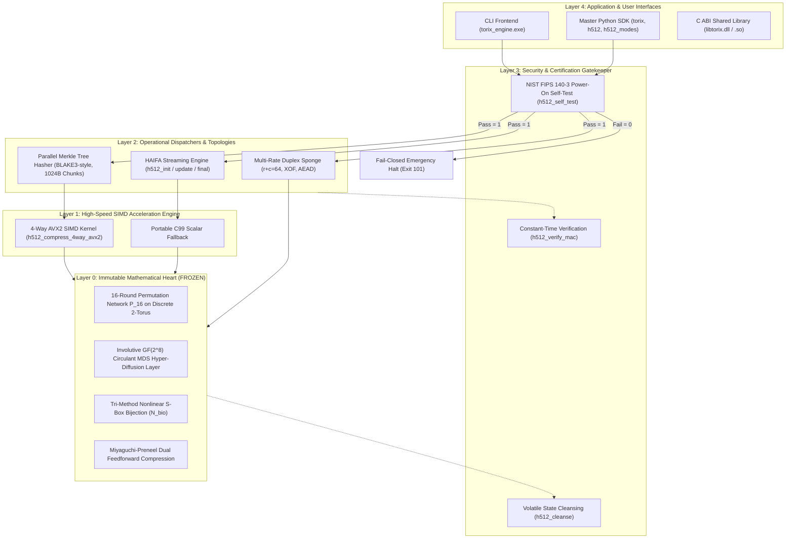

# TORIX-512 / TORIX Cryptographic Suite: Comprehensive API & Syntax Manual
**Document Version:** 2.1 (Post-Upgrade A & Step 2 FIPS Certification)  
**Standard Compliance:** NIST FIPS 140-3 Power-On Self-Test (POST), RFC 5869 (HKDF), HAIFA Counter Framework, BLAKE3 Parallel Tree Topologies, Constant-Time Side-Channel Invariance  
**Language Interfaces:** C99 / AVX2 Native Engine, Command-Line Interface (CLI), Python Reference & Extended Modes

---

## Table of Contents
1. [Architectural Design, Structure & Core Engine](#1-architectural-design-structure--core-engine)
   - [Core Cryptographic Design Philosophy](#core-cryptographic-design-philosophy)
   - [Mathematical Invariance & Zero-Change Principle](#mathematical-invariance--zero-change-principle)
   - [Multi-Layer System Architecture](#multi-layer-system-architecture)
   - [Single-File Engine Layout](#single-file-engine-layout)
2. [Command-Line Interface (CLI) Complete Syntax](#2-command-line-interface-cli-complete-syntax)
   - [Basic Hashing](#basic-hashing)
   - [File Hashing](#file-hashing)
   - [AVX2 Parallel Tree Hashing](#avx2-parallel-tree-hashing)
   - [Throughput Benchmarking](#throughput-benchmarking)
   - [Authenticated Encryption with Associated Data (AEAD)](#authenticated-encryption-with-associated-data-aead)
   - [Extendable Output Function (XOF)](#extendable-output-function-xof)
   - [NIST Statistical Test Generators](#nist-statistical-test-generators)
3. [C API Reference Manual (`src/h512.h`)](#3-c-api-reference-manual-srch512h)
   - [HAIFA Domain Tags & Constants](#haifa-domain-tags--constants)
   - [Stateful Streaming Hash API](#stateful-streaming-hash-api)
   - [One-Shot Hash API](#one-shot-hash-api)
   - [Parallel Binary Merkle Tree Hasher](#parallel-binary-merkle-tree-hasher)
   - [AVX2 4-Way SIMD Vectorization Primitives](#avx2-4-way-simd-vectorization-primitives)
   - [Side-Channel Hardening & Security Utilities](#side-channel-hardening--security-utilities)
   - [TORIX-Sponge Multi-Rate Duplex & XOF](#torix-sponge-multi-rate-duplex--xof)
   - [TORIX-AEAD Authenticated Encryption](#torix-aead-authenticated-encryption)
   - [NIST/FIPS-Style Power-On Self-Test (POST)](#nistfips-style-power-on-self-test-post)
4. [Python API Reference Manual](#4-python-api-reference-manual)
   - [Core Hasher (`python/h512.py`)](#core-hasher-pythonh512py)
   - [Tree Hashing & Merkle Inclusion Proofs (`python/h512_modes.py`)](#tree-hashing--merkle-inclusion-proofs-pythonh512_modespy)
   - [RFC 5869 Key Derivation Function (`hkdf_h512`)](#rfc-5869-key-derivation-function-hkdf_h512)
   - [Arbitrary-Length XOF Stream (`h512_xof`)](#arbitrary-length-xof-stream-h512_xof)
   - [AEAD & Duplex Sponge (`torix_aead.py`, `torix_sponge.py`)](#aead--duplex-sponge-torix_aeadpy-torix_spongepy)
   - [NIST/FIPS Power-On Self-Test (`torix.self_test()`, `h512.h512_self_test()`)](#nistfips-power-on-self-test-torixself_test-h512h512_self_test)
5. [Compilation, Linking & Integration Guide](#5-compilation-linking--integration-guide)
   - [Building the Executable Engine](#building-the-executable-engine)
   - [Building Shared DLL / Shared Object](#building-shared-dll--shared-object)
   - [Python Ctypes Interop](#python-ctypes-interop)
6. [Quick Reference Cheat Sheet](#6-quick-reference-cheat-sheet)

---

## 1. Architectural Design, Structure & Core Engine

### Core Cryptographic Design Philosophy
TORIX-512 decouples its **immutable mathematical core** from its **high-throughput execution and certification infrastructure**:



### Mathematical Invariance & Zero-Change Principle
> [!NOTE]
> **The underlying mathematical equations of TORIX-512 are strictly invariant and frozen.**
> Upgrades in this release affect **only hardware execution topology (SIMD), parallel chunking (Merkle tree), file consolidation, and certification self-tests**.
> - **Miyaguchi-Preneel Compression:** $$S_i = P_{16}(S_{i-1} \oplus M_{\text{disp}} \oplus C(i, t)) \oplus S_{i-1} \oplus M_{\text{disp}}$$ (Unchanged).
> - **GF($2^8$) Circulant MDS Diffusion:** Circulant matrix polynomial $x^8 + x^4 + x^3 + x + 1$ (Unchanged).
> - **Nonlinear S-Box Bijection:** 8-bit involutive substitution layer $\chi_8$ (Unchanged).
> - **TORIX-256 Cross-Fold:** $$H_{256}[r][c] = S[r][c] \oplus \text{NBIO}(S[r+4][c])$$ (Unchanged).
> - **Verified Parity:** Golden digest for `"abc"` is mathematically fixed to `97baaec0f04a...` across all versions.

### Single-File Engine Layout
All C cryptographic code is consolidated into a lean, single-file architecture:

```
src/
├── h512.c           <-- COMPLETE ENGINE: Single-file C99/AVX2 implementation (< 1,050 lines)
│   ├── Section 1: Bitwise & Linear Algebra Utilities (rotl8, rotl4, xtime, circulant MDS)
│   ├── Section 2: Core Permutation Network P_16 & Miyaguchi-Preneel Compression
│   ├── Section 3: AVX2 4-Way Inter-Chunk SIMD Vectorization Engine
│   ├── Section 4: Parallel Binary Merkle Tree Hasher (O(log N) Streaming)
│   ├── Section 5: TORIX-Sponge Multi-Rate Duplex & Post-Quantum XOF
│   ├── Section 6: TORIX-AEAD Single-Pass Authenticated Encryption
│   └── Section 7: NIST/FIPS-Style Power-On Self-Test (POST) Engine
├── h512.h           <-- UNIFIED PUBLIC API: All prototypes, structures, tags, and macros
├── h512_constants.h <-- FROZEN CRYPTOGRAPHIC CONSTANTS: NUMS IVs, S-box table, round constants
└── h512_cli.c       <-- CLI FRONTEND: Terminal harness with automatic startup POST gatekeeper
```

*(Auxiliary forwarders `torix_aead.h`/`.c` and `torix_sponge.h`/`.c` exist purely as thin 2-line backward-compatibility redirects into `h512.h`).*

---

## 2. Command-Line Interface (CLI) Complete Syntax

The compiled binary is **`torix_engine.exe`** (or `./torix_engine` on Unix).

### Basic Hashing
Compute 512-bit or 256-bit digests of strings passed directly on the command line:

```bash
# Standard 512-bit digest (Default)
./torix_engine.exe "Project H-512 Reference Cryptographic Hash Engine"

# Truncated 256-bit digest (Nonlinear cross-fold)
./torix_engine.exe -256 "Project H-512 Reference Cryptographic Hash Engine"
```

### File Hashing
Stream any file from disk in 64 KB buffers using sequential hashing:

```bash
# Hash a file with full 512-bit output
./torix_engine.exe -f document.pdf
./torix_engine.exe --file C:\path\to\archive.tar.gz

# Hash a file with 256-bit output
./torix_engine.exe -f document.pdf -256
```
**Output Format:** `<hex_digest>  <filepath>` (Identical to `sha256sum` / `b3sum`).

### AVX2 Parallel Tree Hashing
Computes a BLAKE3-style parallel binary Merkle tree hash across independent 1024-byte leaf chunks:

```bash
# Hash a string via parallel tree reduction
./torix_engine.exe --tree "Large payload string..."
./torix_engine.exe -t "Short alias"

# Hash a multi-gigabyte file using 4-way AVX2 leaf SIMD
./torix_engine.exe --tree ubuntu-24.04-desktop-amd64.iso
```

### Throughput Benchmarking
```bash
# 1. Benchmark 4-Way AVX2 Parallel Tree Engine (10 MB & 50 MB streams)
./torix_engine.exe --bench-tree

# Expected Output:
# [*] Hardware AVX2 Support : DETECTED & ACTIVE (4-Way Vectorized)
# [*] Benchmarking Tree Hash (10 MB payload, 1024B chunks)...
#     Throughput  : ~42.00 MB/second

# 2. Benchmark Sequential C99 Engine (10 MB stream)
./torix_engine.exe --bench
```

### Authenticated Encryption with Associated Data (AEAD)
Single-pass authenticated encryption with 256-bit secret key and 128-bit unique nonce:

```bash
# 1. ENCRYPTION
# Syntax: --encrypt -k <hex_key_32B> -n <hex_nonce_16B> -m <plaintext> [-ad <associated_data>]
./torix_engine.exe --encrypt \
  -k 000102030405060708090a0b0c0d0e0f101112131415161718191a1b1c1d1e1f \
  -n a0a1a2a3a4a5a6a7a8a9aaabacadaeaf \
  -m "Top Secret Data Stream" \
  -ad "metadata-header-001"

# Output:
# Ciphertext (hex): e7f5c928...
# Tag (hex)       : 4a8b1c92...

# 2. DECRYPTION
# Syntax: --decrypt -k <key> -n <nonce> -c <ciphertext_hex> -t <tag_hex> [-ad <ad>]
./torix_engine.exe --decrypt \
  -k 000102030405060708090a0b0c0d0e0f101112131415161718191a1b1c1d1e1f \
  -n a0a1a2a3a4a5a6a7a8a9aaabacadaeaf \
  -c e7f5c928... \
  -t 4a8b1c92... \
  -ad "metadata-header-001"

# Output on valid authentication:
# Decrypted: Top Secret Data Stream

# Output on tampering (1-bit mismatch in key, nonce, ciphertext, tag, or AD):
# AUTHENTICATION_FAILED: Tag mismatch or data tampering detected!
```

### Extendable Output Function (XOF)
Produces arbitrary lengths of cryptographically secure pseudorandom bytes:

```bash
# Syntax: --xof <output_byte_length> <message_seed>
./torix_engine.exe --xof 64 "seed material"
./torix_engine.exe --xof 1024 "deterministic key generator"
```

### NIST Statistical Test Generators
Generates binary files for feeding into the NIST SP 800-22 Randomness Test Suite:

```bash
# Generate N bytes of continuous pseudo-random stream into a file
./torix_engine.exe --stream-file nist_stream.bin 10485760

# Generate 512x512 Strict Avalanche Criterion (SAC) correlation matrix binary
./torix_engine.exe --sac-file sac_samples.bin 1000
```

---

## 3. C API Reference Manual (`src/h512.h`)

Include the unified header in any C/C++ project:
```c
#include "h512.h"
```

### HAIFA Domain Tags & Constants
| Constant | Value | Description |
|---|---|---|
| `H512_TAG_STANDARD_512` | `0x00` | Standard 512-bit hash mode |
| `H512_TAG_TRUNCATED_256` | `0x01` | Truncated 256-bit nonlinear fold mode |
| `H512_TAG_TREE_LEAF` | `0x02` | Independent 1024-byte Merkle tree leaf chunk |
| `H512_TAG_TREE_INTERNAL` | `0x03` | Binary Merkle tree parent node (128-byte reduction) |
| `H512_TAG_TREE_ROOT` | `0x04` | Final Merkle tree root finalization |
| `H512_TAG_XOF_STREAM` | `0x05` | Extendable-output function stream |
| `H512_DEFAULT_CHUNK_SIZE` | `1024` | Default chunk size in bytes (16 blocks) |

---

### Stateful Streaming Hash API

#### `h512_init`
```c
void h512_init(h512_ctx *ctx);
```
Initializes context for standard 512-bit hashing under domain tag `0x00`.

#### `h256_init`
```c
void h256_init(h512_ctx *ctx);
```
Initializes context for truncated 256-bit hashing under domain tag `0x01`.

#### `h512_init_tag`
```c
void h512_init_tag(h512_ctx *ctx, uint8_t domain_tag);
```
Initializes context with an explicit HAIFA domain separation tag.

#### `h512_update`
```c
void h512_update(h512_ctx *ctx, const void *data, size_t len);
```
Pumps arbitrary data slices into the running context. Buffers partial blocks and automatically triggers 16-round Miyaguchi-Preneel compression upon reaching 64 bytes.

#### `h512_final`
```c
void h512_final(h512_ctx *ctx, uint8_t out[64]);
```
Applies HAIFA length padding, compresses final blocks, and serializes the 512-bit (64-byte) canonical row-major digest to `out`.

#### `h256_final`
```c
void h256_final(h512_ctx *ctx, uint8_t out[32]);
```
Applies HAIFA padding and executes the nonlinear cross-fold $S[r][c] \oplus \mathcal{N}_{\text{bio}}(S[r+4][c])$, outputting 32 bytes to `out`.

**Streaming Example:**
```c
h512_ctx ctx;
uint8_t digest[64];

h512_init(&ctx);
while ((bytes_read = fread(buf, 1, sizeof(buf), fp)) > 0) {
    h512_update(&ctx, buf, bytes_read);
}
h512_final(&ctx, digest);
h512_cleanse(&ctx, sizeof(ctx)); // FIPS 140-3 state wiping
```

---

### One-Shot Hash API

#### `h512_hash`
```c
void h512_hash(const void *data, size_t len, uint8_t out[64]);
```
Computes full 512-bit digest in one call with zero heap allocations and automatic internal state cleansing.

#### `h256_hash`
```c
void h256_hash(const void *data, size_t len, uint8_t out[32]);
```
Computes truncated 256-bit digest in one call.

#### `h512_hash_tag`
```c
void h512_hash_tag(const void *data, size_t len, uint8_t domain_tag, uint8_t out[64]);
```
Computes hash under an arbitrary HAIFA domain separation tag.

---

### Parallel Binary Merkle Tree Hasher

#### `h512_tree_hash`
```c
void h512_tree_hash(const void *data, size_t len, size_t chunk_size, uint8_t out[64]);
```
- **`data`**: Pointer to input memory buffer.
- **`len`**: Total byte length of data.
- **`chunk_size`**: Chunk partition size (pass `0` or `1024` for default).
- **`out`**: Output buffer receiving 64-byte root digest.
- **Behavior**:
  - If `len <= chunk_size`: Maps to `h512_hash` (Base Case).
  - If `len > chunk_size`: Hashes leaves with `TAG_TREE_LEAF` (automatically routed to AVX2 SIMD), reduces internal nodes with `TAG_TREE_INTERNAL`, and finalizes root with `TAG_TREE_ROOT`.

#### `h512_tree_hash_file`
```c
int h512_tree_hash_file(const char *filepath, size_t chunk_size, uint8_t out[64]);
```
Computes tree hash of a file on disk. Returns `0` on success, or negative error code on file/memory failure.

---

### AVX2 4-Way SIMD Vectorization Primitives

#### `h512_has_avx2`
```c
int h512_has_avx2(void);
```
Returns `1` if host CPU supports AVX2 (via hardware CPUID), `0` otherwise.

#### `h512_compress_4way_avx2`
```c
void h512_compress_4way_avx2(uint8_t S[4][8][8], const uint8_t (*blocks)[64], uint64_t cumulative_bits);
```
Low-level 4-way compression kernel. Compresses four 64-byte blocks across 4 independent states $S_0, S_1, S_2, S_3$ simultaneously using 256-bit SIMD registers (`__m256i`).

#### `h512_hash_leaf_chunks_4way_avx2`
```c
void h512_hash_leaf_chunks_4way_avx2(const uint8_t *const chunks[4], size_t chunk_len, uint8_t out[4][64]);
```
Hashes 4 independent 1024-byte chunks in lockstep under `H512_TAG_TREE_LEAF`. Produces four 64-byte leaf digests simultaneously.

---

### Side-Channel Hardening & Security Utilities

#### `h512_verify_mac`
```c
int h512_verify_mac(const uint8_t *a, const uint8_t *b, size_t len);
```
Constant-time, branchless byte-comparison. Eliminates timing side-channel leaks (DPA/CPA attacks). Returns `1` if buffers are identical, `0` if different.

#### `h512_cleanse`
```c
void h512_cleanse(void *v, size_t n);
```
Secure zeroization of sensitive memory. Uses volatile function pointers and inline compiler memory barriers to guarantee that the compiler will **never** optimize away the clearing of keys or intermediate states.

#### `h512_to_hex`
```c
void h512_to_hex(const uint8_t *bytes, size_t len, char *hex_out);
```
Converts raw byte array to lowercase hexadecimal string (null-terminated, requiring `len * 2 + 1` characters in `hex_out`).

---

### TORIX-Sponge Multi-Rate Duplex & XOF

#### `torix_sponge_init`
```c
void torix_sponge_init(torix_sponge_ctx *ctx, size_t rate, size_t capacity, uint8_t domain_tag);
```
Initializes a sponge state with rate $r$ and capacity $c$ ($r + c = 64$ bytes).

#### `torix_sponge_absorb`
```c
void torix_sponge_absorb(torix_sponge_ctx *ctx, const uint8_t *data, size_t len);
```
Absorbs data with pad10*1 multi-rate padding.

#### `torix_sponge_squeeze`
```c
void torix_sponge_squeeze(torix_sponge_ctx *ctx, uint8_t *out, size_t out_len);
```
Squeezes arbitrary number of bytes from the sponge capacity.

#### `torix_sponge_duplex`
```c
void torix_sponge_duplex(torix_sponge_ctx *ctx, const uint8_t *data_in, size_t in_len, uint8_t *out, size_t out_len);
```
Executes a single duplex step: absorbs `data_in` and immediately squeezes `out`.

#### `torix_xof`
```c
void torix_xof(const uint8_t *data, size_t len, uint8_t *out, size_t out_len, int post_quantum);
```
One-shot extendable output function. Pass `post_quantum = 1` for 256-bit PQ security ($r=16, c=48$), or `0` for 128-bit security ($r=32, c=32$).

---

### TORIX-AEAD Authenticated Encryption

#### `torix_aead_encrypt`
```c
void torix_aead_encrypt(const uint8_t key[32],
                        const uint8_t nonce[16],
                        const uint8_t *plaintext,
                        size_t pt_len,
                        const uint8_t *associated_data,
                        size_t ad_len,
                        uint8_t *ciphertext,
                        uint8_t tag[32]);
```
- **`key`**: 32-byte (256-bit) secret key.
- **`nonce`**: 16-byte (128-bit) unique nonce.
- **`plaintext` / `pt_len`**: Unencrypted input data.
- **`associated_data` / `ad_len`**: Authenticated unencrypted metadata (headers, routing info). Can be `NULL` and `0`.
- **`ciphertext`**: Buffer receiving ciphertext (must be $\ge$ `pt_len` bytes).
- **`tag`**: Buffer receiving 32-byte authentication tag.

#### `torix_aead_decrypt`
```c
int torix_aead_decrypt(const uint8_t key[32],
                       const uint8_t nonce[16],
                       const uint8_t *ciphertext,
                       size_t ct_len,
                       const uint8_t tag[32],
                       const uint8_t *associated_data,
                       size_t ad_len,
                       uint8_t *plaintext);
```
Decrypts and authenticates. Returns `1` if tag is valid. Returns `0` if tampering is detected, and wipes `plaintext` memory clean.

---

### NIST/FIPS-Style Power-On Self-Test (POST)

#### `h512_self_test`
```c
int h512_self_test(void);
```
- **Returns**: `H512_SELF_TEST_PASS` (`1`) on complete algorithmic integrity, `H512_SELF_TEST_FAIL` (`0`) on any anomaly.
- **Verification Scope**:
  1. Standard TORIX-512 KAT against `"abc"`.
  2. Standard TORIX-256 truncated cross-fold KAT against `"abc"`.
  3. TORIX-512 empty input KAT against `""`.
  4. Parallel binary Merkle tree hasher KAT (4096-byte deterministic vector exercising 4-way AVX2 leaf SIMD).
  5. Constant-time MAC verify rejection behavior check (fault injection validation).
  6. Cryptographic volatile scrubbing of all scratch memory buffers using `h512_cleanse`.
- **Automatic Enforcement**: The native CLI binary `torix_engine` automatically executes `h512_self_test()` on startup before handling any hashing, benchmarking, or encryption operations.

---

## 4. Python API Reference Manual

### Core Hasher (`python/h512.py`)

```python
import h512

# 1. One-shot Functions
digest_512 = h512.h512_hash(b"data")       # Returns 64 raw bytes
digest_256 = h512.h256_hash(b"data")       # Returns 32 raw bytes
hex_string = h512.hexdigest(digest_512)     # Formats to 128 hex chars

# 2. Stateful Object-Oriented Hasher
hasher = h512.H512Hasher(domain_tag=0x00)
hasher.update(b"chunk 1")
hasher.update(b"chunk 2")
d = hasher.digest()
h = hasher.hexdigest()

# 3. Truncated Hasher
hasher256 = h512.H256Hasher()
hasher256.update(b"chunk")
d256 = hasher256.digest()

# 4. HMAC-H512
mac = h512.hmac_h512(key=b"secret_key", message=b"payload")

# 5. Constant-Time Tag Comparison
valid = h512.constant_time_compare(mac_a, mac_b)
```

---

### Tree Hashing & Merkle Inclusion Proofs (`python/h512_modes.py`)

```python
import h512_modes

data = b"Arbitrary large dataset..."

# 1. Parallel Binary Tree Hash
root_digest = h512_modes.h512_tree_hash(data, chunk_size=1024, num_workers=4)

# 2. Object-Oriented Tree Builder
tree = h512_modes.H512TreeHasher(chunk_size=1024, num_workers=4)
root = tree.hash(data)

# 3. Merkle Authentication Proof Generation (O(log N) Streaming)
builder = h512_modes.MerkleTreeBuilder(data, chunk_size=1024)
root_hash = builder.root
proof = builder.get_proof(chunk_index=3)  # List of ('left'|'right', sibling_hash)

# 4. Independent Proof Verification
chunk = data[3 * 1024 : 4 * 1024]
is_valid = h512_modes.verify_merkle_proof(
    chunk=chunk,
    chunk_index=3,
    proof=proof,
    root=root_hash
)
assert is_valid == True
```

---

### RFC 5869 Key Derivation Function (`hkdf_h512`)

```python
from h512_modes import hkdf_extract, hkdf_expand, hkdf_h512

ikm = b"input_keying_material_master_secret"
salt = b"cryptographic_salt_or_none"
info = b"protocol_v1_encryption_key"

# Full one-step HKDF (Extract + Expand)
derived_64_bytes = hkdf_h512(salt=salt, ikm=ikm, info=info, length=64)

# Multi-step HKDF
prk = hkdf_extract(salt=salt, ikm=ikm)       # 64-byte Pseudorandom Key
key1 = hkdf_expand(prk=prk, info=b"key1", length=32)
key2 = hkdf_expand(prk=prk, info=b"key2", length=32)
```

---

### Arbitrary-Length XOF Stream (`h512_xof`)

```python
from h512_modes import h512_xof

# Generates 256 bytes of pseudorandom stream deterministically
stream = h512_xof(message=b"seed_password", length=256)
```

---

### AEAD & Duplex Sponge (`torix_aead.py`, `torix_sponge.py`)

```python
from torix_aead import torix_aead_encrypt, torix_aead_decrypt
from torix_sponge import TorixSponge, torix_xof

key = b"\x01" * 32
nonce = b"\x02" * 16
plaintext = b"Classified Payload"
ad = b"session_id_492"

# Encrypt
ciphertext, tag = torix_aead_encrypt(key, nonce, plaintext, ad)

# Decrypt
decrypted, valid = torix_aead_decrypt(key, nonce, ciphertext, tag, ad)
assert valid == True
assert decrypted == plaintext
```

---

### NIST/FIPS Power-On Self-Test (`torix.self_test()`, `h512.h512_self_test()`)

```python
import torix
import h512

# 1. Run via Unified SDK Facade
if torix.self_test():
    print("TORIX cryptographic engine certified & ready.")
else:
    raise RuntimeError("Cryptographic self-test failed!")

# 2. Run via Core Engine
assert h512.h512_self_test() is True
```

---

## 5. Compilation, Linking & Integration Guide

### Building the Executable Engine
Because all algorithms are unified into `src/h512.c`, compilation requires only two source files:

```bash
# GCC (Linux / MinGW Windows)
gcc -O3 -std=c99 -mavx2 -Wall -Wextra -pedantic -Isrc src/h512.c src/h512_cli.c -o torix_engine.exe

# Clang
clang -O3 -std=c99 -mavx2 -Isrc src/h512.c src/h512_cli.c -o torix_engine

# MSVC (Visual Studio Developer Command Prompt)
cl /O2 /arch:AVX2 /Isrc src/h512.c src/h512_cli.c /Fe:torix_engine.exe
```

### Building Shared DLL / Shared Object
```bash
# Windows DLL
gcc -O3 -std=c99 -mavx2 -shared -Isrc src/h512.c -o libtorix.dll

# Linux / macOS Shared Library
gcc -O3 -std=c99 -mavx2 -fPIC -shared -Isrc src/h512.c -o libtorix.so
```

### Python Ctypes Interop
Load the unified `libtorix.dll` or `libtorix.so` directly into Python:

```python
import ctypes
import os

lib = ctypes.CDLL("./libtorix.dll")

# Prototype: void h512_hash(const void *data, size_t len, uint8_t out[64]);
lib.h512_hash.argtypes = [ctypes.c_char_p, ctypes.c_size_t, ctypes.c_char_p]
lib.h512_hash.restype = None

def fast_c_hash(data: bytes) -> bytes:
    out = ctypes.create_string_buffer(64)
    lib.h512_hash(data, len(data), out)
    return out.raw

# Prototype: void h512_tree_hash(const void *data, size_t len, size_t chunk_size, uint8_t out[64]);
lib.h512_tree_hash.argtypes = [ctypes.c_char_p, ctypes.c_size_t, ctypes.c_size_t, ctypes.c_char_p]
lib.h512_tree_hash.restype = None

def fast_c_tree_hash(data: bytes, chunk_size: int = 1024) -> bytes:
    out = ctypes.create_string_buffer(64)
    lib.h512_tree_hash(data, len(data), chunk_size, out)
    return out.raw
```

---

## 6. Quick Reference Cheat Sheet

| Task | C Function | CLI Command | Python Function |
|---|---|---|---|
| **TORIX-512 Hash** | `h512_hash(data, len, out)` | `./torix_engine.exe "text"` | `h512.h512_hash(b"text")` |
| **TORIX-256 Hash** | `h256_hash(data, len, out)` | `./torix_engine.exe -256 "text"` | `h512.h256_hash(b"text")` |
| **Tree Hash (AVX2)** | `h512_tree_hash(data, len, 1024, out)` | `./torix_engine.exe --tree file` | `h512_modes.h512_tree_hash(data)` |
| **Tree Benchmark** | *(via CLI)* | `./torix_engine.exe --bench-tree` | *(via verify_phase12.py)* |
| **AEAD Encrypt** | `torix_aead_encrypt(...)` | `./torix_engine.exe --encrypt ...` | `torix_aead.torix_aead_encrypt(...)` |
| **AEAD Decrypt** | `torix_aead_decrypt(...)` | `./torix_engine.exe --decrypt ...` | `torix_aead.torix_aead_decrypt(...)` |
| **SHAKE-Style XOF** | `torix_xof(data, len, out, out_len, 0)` | `./torix_engine.exe --xof <len> "msg"` | `h512_modes.h512_xof(msg, len)` |
| **HKDF Key Derivation** | *(via sponge/hash)* | *(internal protocol)* | `h512_modes.hkdf_h512(...)` |
| **Constant-Time MAC** | `h512_verify_mac(a, b, len)` | *(internal)* | `h512.constant_time_compare(a, b)` |
| **FIPS Self-Test (POST)** | `h512_self_test()` | *(Automatic on startup)* | `torix.self_test()` / `h512.h512_self_test()` |
| **Volatile Cleanse** | `h512_cleanse(ptr, len)` | *(internal)* | *(garbage collected)* |
