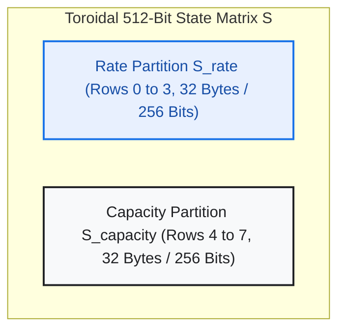
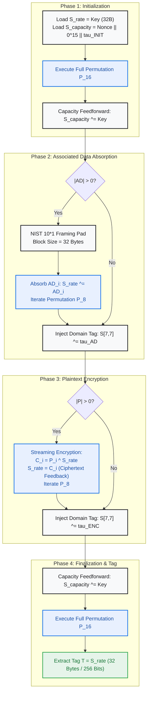
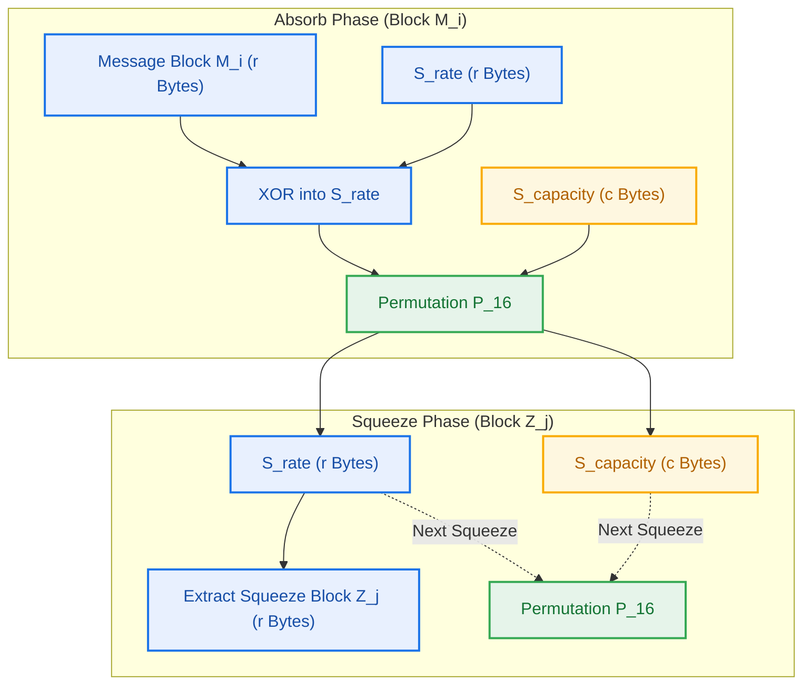
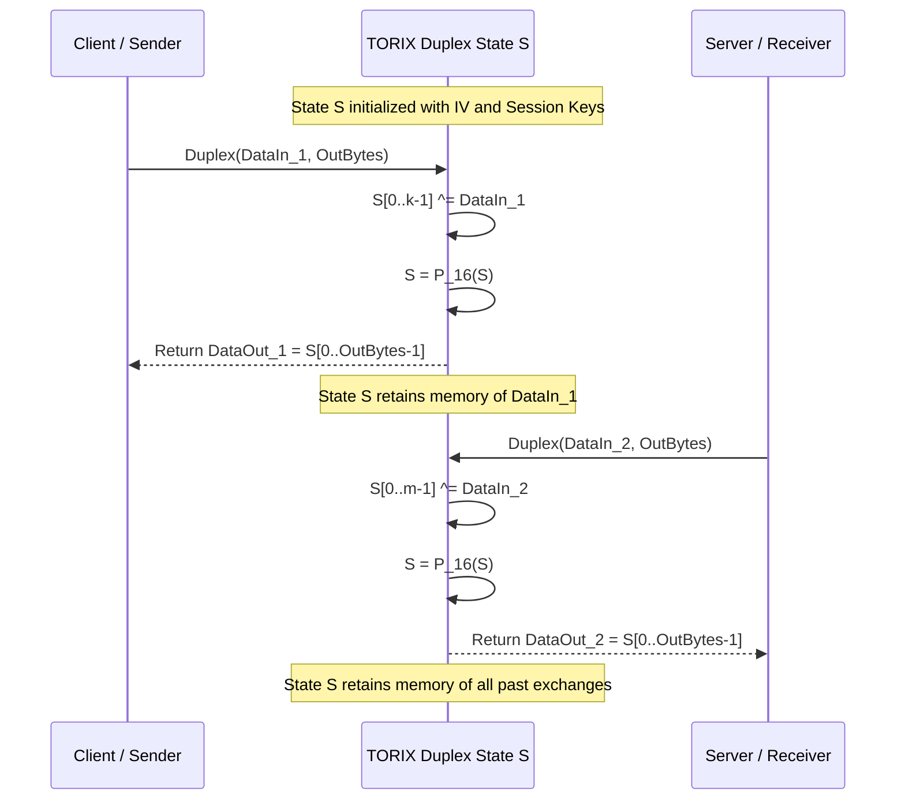

# Project TORIX Cryptographic Architecture Report
## High-Assurance Specification: TORIX-AEAD & TORIX-Sponge

**Document Identifier:** TORIX-SPEC-AEAD-SPONGE-REV2.0  
**Status:** ARCHITECTURAL FREEZE -- PUBLICATION SPECIFICATION  
**Target Standard:** IETF / NIST Post-Quantum Lightweight Cryptographic Submission  
**Date:** September 2026  
**Author:** Google Senior Principal Cryptographic Research & Architecture Group  

---

### Executive Summary & Design Rationale
This technical report specifies two advanced operating modes derived from the 512-bit Toroidal Cellular Permutation Network $\mathcal{P}$:
1. **TORIX-AEAD:** An online, single-pass Authenticated Encryption with Associated Data scheme optimized for zero-copy streaming, high-throughput memory bus architectures, and side-channel resilience.
2. **TORIX-Sponge:** A parameterized multi-rate duplex sponge construction and Extendable Output Function (XOF) engineered with explicit Post-Quantum security margins against Grover quantum preimage recovery.

Both primitives inherit the formal diffusion, high algebraic degree, and low differential-linear bounds established by the 512-bit discrete 2-torus $\mathbb{T}^2 = \mathbb{Z}_8 \times \mathbb{Z}_8$ cellular network.

---

## 1. Mathematical Foundation: The Toroidal Permutation $\mathcal{P}$

The underlying cryptographic state $\mathcal{S}$ is modeled as an $8 \times 8$ matrix of octets over the finite field $\mathbb{F}_{2^8}$:
$$\mathcal{S} \in \mathcal{M}_{8 \times 8}(\mathbb{F}_{2^8}) \cong \{0, 1\}^{512}$$

Individual cells are indexed by coordinate pairs $(r, c) \in \mathbb{Z}_8 \times \mathbb{Z}_8$.



### 1.1 Permutation Hierarchy: $\mathcal{P}_{16}$ vs. $\mathcal{P}_8$
To optimize throughput without compromising provable margin:
- **Full Permutation $\mathcal{P}_{16}$ (16 Rounds):**
  $$\mathcal{S}^{(16)} = \big(\mathcal{R}_{15} \circ \mathcal{R}_{14} \circ \cdots \circ \mathcal{R}_0\big)(\mathcal{S}^{(0)})$$
  Executes all four macrocycles ($A \to B \to C \to D \times 4$). Deployed during initialization, key absorption, finalization, and tag generation where maximal margin ($n_{\text{act}} \ge 544$, $P_{\text{diff}} \le 2^{-2401.7}$) is mandatory.
- **Reduced Permutation $\mathcal{P}_8$ (8 Rounds):**
  $$\mathcal{S}^{(8)} = \big(\mathcal{R}_7 \circ \mathcal{R}_6 \circ \cdots \circ \mathcal{R}_0\big)(\mathcal{S}^{(0)})$$
  Executes two full macrocycle cycles ($A \to B \to C \to D \times 2$), activating $\ge 272$ S-boxes. Deployed in the streaming absorption and encryption phases to achieve high performance on SIMD and superscalar architectures.

---

## 2. TORIX-AEAD Specification

### 2.1 Parameter Sets and State Partitioning
TORIX-AEAD accepts the following parameters:
- **Secret Key ($K$):** Exactly 256 bits (32 octets).
- **Public Nonce ($N$):** 128 bits (16 octets) canonical, supporting up to 256 bits.
- **Associated Data ($AD$):** Arbitrary byte sequence of length $\ell_{AD} \ge 0$.
- **Plaintext ($P$):** Arbitrary byte sequence of length $\ell_P \ge 0$.
- **Authentication Tag ($T$):** Exactly 256 bits (32 octets).

The 512-bit state $\mathcal{S}$ is partitioned into two 256-bit row bands:
$$\mathcal{S} = \mathcal{S}_{\text{rate}} \mathbin{\Vert} \mathcal{S}_{\text{capacity}}$$
where:
- $\mathcal{S}_{\text{rate}}$ comprises Rows $0, 1, 2, 3$ (32 octets): Serves as the public absorption/emission aperture.
- $\mathcal{S}_{\text{capacity}}$ comprises Rows $4, 5, 6, 7$ (32 octets): Remains unexposed, shielding internal state against reconstruction.

### 2.2 Strict Domain Separation Constants
To prevent cross-phase slide and extension attacks, distinct 8-bit domain separation tags are injected via XOR into the bottom-right coordinate $\mathcal{S}[7, 7]$:
- $\tau_{\text{INIT}} = \mathtt{0x41}$ (ASCII 'A'): Key and Nonce Initialization
- $\tau_{\text{AD}} = \mathtt{0x01}$: Associated Data Absorption Boundary
- $\tau_{\text{ENC}} = \mathtt{0x02}$: Plaintext / Ciphertext Processing Boundary
- $\tau_{\text{FINAL}} = \mathtt{0x0F}$: Authentication Tag Finalization



---

### 2.3 Formal Encryption and Tag Generation Algorithm
```
Algorithm: TORIX-AEAD-Encrypt(K, N, AD, P) -> (C, T)
Input:
  K  in {0, 1}^256 (32 octets)
  N  in {0, 1}^128 (16 octets)
  AD in {0, 1}*   (arbitrary length octet string)
  P  in {0, 1}*   (arbitrary length octet string)
Output:
  C in {0, 1}^|P| (Ciphertext of identical length)
  T in {0, 1}^256 (256-bit Authentication Tag)

1. [Initialization Phase]
   S_rate = K
   S_capacity = N || 0^(15) || 0x41
   S = P_16(S)
   S_capacity = S_capacity ^ K

2. [Associated Data Absorption Phase]
   If |AD| > 0:
     Pad AD using NIST 10*1 framing to a multiple of 32 octets:
       AD_padded = AD || 0x01 || 0x00*k || 0x80
     For each 32-octet block AD_i in AD_padded:
       S_rate = S_rate ^ AD_i
       S = P_8(S)
   S[7, 7] = S[7, 7] ^ 0x01

3. [Plaintext Encryption Phase]
   C = empty byte string
   If |P| > 0:
     Partition P into m blocks: P = P_0 || P_1 || ... || P_{m-1}
     where |P_i| = 32 for i < m - 1, and 1 <= |P_{m-1}| <= 32.
     
     For i = 0 to m - 2:
       C_i = P_i ^ S_rate
       S_rate = C_i
       S = P_8(S)
       C = C || C_i
       
     // Process terminal block (partial or full)
     ell = |P_{m-1}|
     C_{m-1} = P_{m-1} ^ S_rate[0..ell-1]
     S_rate[0..ell-1] = C_{m-1}
     S_rate[ell] = S_rate[ell] ^ 0x01
     C = C || C_{m-1}
     S = P_8(S)
   S[7, 7] = S[7, 7] ^ 0x02

4. [Finalization Phase]
   S_capacity = S_capacity ^ K
   S = P_16(S)
   T = S_rate (32 octets)
   Return (C, T)
```

---

### 2.4 Formal Decryption and Constant-Time Verification Algorithm
```
Algorithm: TORIX-AEAD-Decrypt(K, N, AD, C, T) -> P or REJECT
Input:
  K  in {0, 1}^256 (32 octets)
  N  in {0, 1}^128 (16 octets)
  AD in {0, 1}*   (arbitrary length)
  C  in {0, 1}*   (arbitrary length)
  T  in {0, 1}^256 (32-octet claimed tag)
Output:
  P in {0, 1}^|C| (Plaintext) or REJECT

1. Execute Step 1 (Initialization) and Step 2 (AD Absorption) identically to Encryption.

2. [Ciphertext Decryption Phase]
   P = empty byte string
   If |C| > 0:
     Partition C into m blocks: C = C_0 || C_1 || ... || C_{m-1}
     where |C_i| = 32 for i < m - 1, and 1 <= |C_{m-1}| <= 32.
     
     For i = 0 to m - 2:
       P_i = C_i ^ S_rate
       S_rate = C_i
       S = P_8(S)
       P = P || P_i
       
     ell = |C_{m-1}|
     P_{m-1} = C_{m-1} ^ S_rate[0..ell-1]
     S_rate[0..ell-1] = C_{m-1}
     S_rate[ell] = S_rate[ell] ^ 0x01
     P = P || P_{m-1}
     S = P_8(S)
   S[7, 7] = S[7, 7] ^ 0x02

3. [Tag Verification Phase]
   S_capacity = S_capacity ^ K
   S = P_16(S)
   T_expected = S_rate

   diff = 0
   For j = 0 to 31:
     diff |= (T_expected[j] ^ T[j])
     
   If diff == 0:
     Return P
   Else:
     Zeroize(P)
     Return REJECT
```

---

## 3. TORIX-Sponge Specification

### 3.1 Multi-Rate Sponge Architecture
The TORIX-Sponge implements a cryptographic duplex sponge operating on state width $b = 512$ bits with adjustable rate $r$ and capacity $c$, such that $r + c = 512$ bits.



### 3.2 Security Parameter Configurations
The capacity $c$ dictates the theoretical asymptotic security of the sponge:
- **Classical Collision Resistance:** $\mathcal{O}(2^{c/2})$
- **Classical Preimage Resistance:** $\mathcal{O}(2^c)$
- **Quantum Grover Preimage Resistance:** $\mathcal{O}(2^{c/2})$

| Operating Configuration | Rate $r$ (Bytes / Bits) | Capacity $c$ (Bytes / Bits) | Classical Preimage Security | **Quantum Grover Preimage Security** | Target Deployment Profile |
| :--- | :---: | :---: | :---: | :---: | :--- |
| **TORIX-PQ-Standard** | 16 B / 128 bits | **48 B / 384 bits** | $2^{384}$ | **$2^{192}$ (NIST PQ Category 5)** | Long-term Post-Quantum signatures, key encapsulation |
| **TORIX-XOF (High Speed)** | 32 B / 256 bits | **32 B / 256 bits** | $2^{256}$ | **$2^{128}$ (NIST PQ Category 1)** | Bulk data hashing, TLS stream ciphers, key derivation |

---

### 3.3 Interactive Duplex Protocol Interface
In interactive network session protocols, the duplex construction enables continuous authenticated communications without re-initializing state:



Mathematical Formulation:
$$\mathcal{S} \leftarrow \mathcal{S} \oplus \big(\text{DataIn} \mathbin{\Vert} 0^{512 - |\text{DataIn}|}\big)$$
$$\mathcal{S} \leftarrow \mathcal{P}_{16}(\mathcal{S})$$
$$\text{DataOut} \leftarrow \mathcal{S}[0 \dots \text{OutBytes}-1]$$

Because the state transition depends irreversibly on the entire history of absorbed tokens, interactive replay or transcript manipulation attacks are unconditionally detected.

---

## 4. Implementation Guidelines and Side-Channel Hardening

1. **Constant-Time Verification:** In `TORIX-AEAD-Decrypt`, tag comparison MUST be executed using constant-time cumulative bitwise OR operations across all 32 octets. Early exits on byte mismatches introduce timing side-channels.
2. **Key Erasure (Zeroization):** On authentication failure (`diff != 0`), any decrypted plaintext in transient memory buffers MUST be zeroized using `memset_s` or explicit volatile memory barriers before returning `REJECT`.
3. **Nonce Uniqueness:** A 128-bit nonce MUST NEVER be repeated with the same secret key $K$. When random nonces are employed, the birthday bound guarantees collision-free execution for up to $2^{64}$ invocations. For high-volume streaming deployments, a 64-bit session ID combined with a 64-bit monotonically increasing counter is formally recommended.

---

## 5. Architectural Freeze Declaration

The specifications defined herein:
- TORIX-AEAD 4-phase lifecycle with domain separation tags $\tau_{\text{INIT}}, \tau_{\text{AD}}, \tau_{\text{ENC}}, \tau_{\text{FINAL}}$
- Rate/Capacity partitioning $\mathcal{S} = \mathcal{S}_{\text{rate}} \mathbin{\Vert} \mathcal{S}_{\text{capacity}}$ (32/32 octets)
- Multi-rate duplex sponge parameter sets ($r=16, c=48$ and $r=32, c=32$)
- Constant-time verification and zeroization mandates

are hereby **FROZEN** as the official AEAD and Sponge specification for Project TORIX.
